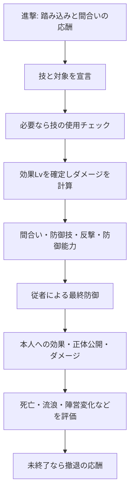

# 魔導戦記のルール整理とオンライン化の論点

調査日: 2026-09-07。これは実装のための調査記録であり、公式ルールの改訂ではありません。

## 更新状況

ユーザー選択により2nd採用が確定。以降の初期調査を土台に、[全220行動カード・26人物と補完裁定案](second-edition/README.md)を追加した。以下の「要確認」は初期調査時点の記録。R01は解決、R02/R03は将来の3rd対応へ移管、R04–R12は具体案を作成し、2026-09-08に試作基準として暫定採用済み。

## 1. 根拠の区別

- **2E確定**: [MadoRule.pdf](../../resources/original/second-edition/MadoRule.pdf) の共通ルール。ページ番号はPDFの1始まり。基本手順はp.2-6、残りは主に背景・補足。
- **カード目視**: [CardAll.pdf](../../resources/original/second-edition/CardAll.pdf) 全25ページ、[Character(A4).pdf](../../resources/original/second-edition/Character(A4).pdf) 全7ページを追加校正済み。下記3rd画像は差分調査の範囲。
- **オンライン案**: 紙の卓での相談・宣言を通信プロトコルに変換するための提案。原作の裁定と混同しない。
- **要確認**: 対象版や原資料から確定できない内容。該当機能を本番有効化する前に解決する。

[配布ページ](https://note.com/dreamfv/n/nb58307ec682c) はPDFを第2版、ZIPを3rd Ed.と区別しています。提供ZIPの中に独立した共通ルール文書はありません。3rd Ed.の全ルールを理解・確定したとは扱いません。

## 2. 第2版の骨格

| 項目 | 2E確定事項 | 出典 |
|---|---|---|
| 人数 | 4-10人、適正6-8人。11人以上も可能だが長時間化 | p.2 §2 |
| 陣営 | GOOD / EVILを基本に、個別の変化・特殊陣営がある | p.2、キャラクター各カード |
| キャラクター | 26枚。GOOD11、EVIL13、変身2。変身2枚を初期配布から除く | p.2-3 |
| 行動カード | 220枚。技97、踏み込み21、間合い15、従者40、OPEN5、一般42 | p.2 |
| 配役 | 基本配布は両陣営から人数の半分を切り捨てで選ぶ。奇数の残り1人は残りからランダム。上級配布は完全ランダム | p.3 §4.1 |
| 秘密情報 | 初期キャラクターは本人だけ見る。手札、伏せた詠唱、未公開の従者を扱う | p.3、p.5 |
| 初期手札 | 5枚。OPENを引いたら直ちに公開し補充。従者は最大2枚配置して補充を繰り返せるが、配置済み従者の取り替えは不可 | p.3 §4.3-4.4 |
| 順番 | 開始プレイヤーを決め、時計回り | p.4 §5.1 |
| 判定 | 精神力チェックは2d6で精神力値以下 | p.4 §6.2.1 |

開始プレイヤーの決め方をオンラインではサーバー抽選にする案。乱数結果は保存し、再接続で引き直さない。配布デッキの順序は公開しない。

### 手番

`回復 → 任意の1枚ドロー → 行動1つ → 手札5枚への調整 → 次の人`

回復は持続効果ごとに判定し、魔詩の例では初回-3、次-2、その後-1と修正が推移します。停止からの回復に失敗すると手番終了。回復すれば直ちに5枚まで補充します。行動は攻撃・詠唱・従者配置・「手番」カードのいずれかです。従者配置では前後の並び替えのみも可能。詠唱枠は通常1枚です。（p.4-5）

本文のドローは「加えることができます」、[Summary.pdf](../../resources/original/second-edition/Summary.pdf) には簡略化して「引く」とあります。2Eでは詳細本文の任意ドローを基準にします。3rd Ed.にこの解釈を無断適用しません。

### 攻撃

図は主経路です。判定失敗・相殺・反撃・介入では途中終了や別の防御処理へ分岐します。

- 近距離技は近距離のみ、遠距離技はどちらでも攻撃できる。距離指定のない技は自発攻撃できない。（p.4）
- 能力Lv不足の技は不足するLvの数だけ精神力チェックを通す必要がある。「使用Lv」「効果Lv」「ダメージ」を別々の値として持つ。（p.4）
- 効果Lvを宣言した後に攻撃側が特殊能力でそれを変更することはできない。ダメージ増加は続くダメージ計算時に宣言する。（p.4）
- 防御手段は複数回試せる。転移失敗後に反撃を試す例がある。（p.4-5）
- 反撃は効果Lvが元の技以上。等しければ相殺。大きければ元の技を消し、届く距離なら反撃技が攻撃になる。打ち消した技のダメージ等を差し引かない。（p.5）
- 従者は最終防御であり強制。受け始めた防御側は、その攻撃に対する手札・能力による防御へ戻れない。（p.5、赤字の注意）
- 従者を前から公開し、必要な士気判定を行う。従者Lvが技より高いなら防ぐ、同値なら従者死亡で止める、低ければ破壊して次へ。低い場合は従者HP分をダメージから減らす。固有の破壊・無視効果もある。（p.5）
- ダメージ0でも本人に技が届けば正体公開する。公開済み同陣営への攻撃は制約があるが、従者受け開始後の公開では攻撃を受ける。（p.2、p.5-6 §11.5）

## 3. 差し込み処理の分類

一つの汎用「カードを後入れ先出しで解決するスタック」だけでは不十分です。原作はフェイズ境界・宣言済みの値・防御の終了境界を持つため、**明示的な状態遷移 + 中断位置 + 反応受付窓**が必要です。

| 窓 / 契機 | 誰が何を選ぶか | 終了・再開に必要な情報 | 出典・確度 |
|---|---|---|---|
| 初期補充・通常の補充 | OPENを公開して効果を処理、さらに補充 | 補充理由、目標枚数、OPEN処理中の子処理 | 初期配布はp.3確定。以後の一般化・順序は要確認 |
| 進撃 / 撤退 | 当事者が踏み込み / 間合いを交互に使う・やめる | 距離の組、使用枚数、次の回答者 | p.4-5 |
| 攻撃の宣言 | 攻撃側が能力や複合効果の適用を選ぶ | 対象・使用Lv・効果Lvの確定段階 | p.4、カード個別条件 |
| 防御 | 防御側が回避、防御技、反撃、能力を選ぶ | 失敗済みの試行、反撃先、攻撃の残り | p.4-5 |
| 第三者介入 | 条件を満たすプレイヤーが「いつでも」カードを使う | 対象攻撃ID、元の処理の再開点 | p.3、CardAll p.1のケイルベイツ等 |
| 正体公開 | 本人が公開する。能力・陣営関係を再評価 | 従者受け開始済みか、公開前後の情報 | p.6 §11.4-11.7 |
| 従者受け | 強制処理、必要な判定と個別効果 | 前後順、各従者・各ヒットの状態 | p.5 |
| 複数対象 / 複数ヒット | 対象ごと・ヒットごとの防御 | 対象集合、各ヒット、共有する踏み込み | p.5、p.6 §11.1 |
| 停止からの回復 | 本人の手番で効果ごとに判定 | 発生元、修正段階、復帰時補充 | p.4、p.6 §11.2 |
| 死亡 / 流浪 / 復活 | 終了条件と連鎖を評価、必要なら再セットアップ | 死亡時陣営、保護関係、カードの返却先 | p.5-6、CardAll p.1 |

「いつでも」カードは条件付きで手番外にも使え、使用枚数と同数を即座に補充するのが2Eの記述です（p.3）。補充によりさらに介入手段やOPENが生まれ得るため、カード使用だけでなく補充処理自体の中断・再開もモデル化します。

### 複数対象と複数ヒットは別の軸

全体攻撃を受けた複数人の間合いに対し、攻撃者の踏み込み1枚が複数人へ作用し得ます。一方、天地百撃斬のような複数個の技では、各技に間合いや反撃が必要です。従者のHP軽減も各技に作用します。「魔詩・魅了・恐怖」の判定は同じ複数個の技に対して一度でよいとされています。（p.5-6）

従って `AttackGroup → TargetResolution → HitResolution` を分け、共有修正と対象限定修正を別管理します。複数対象を順番に処理するUIを作っても、原作の同時性や共有カードの効き方を変えないことが条件です。

### 秘密の能力を勝手に使わない

2Eでは【制限】を除き、本人が特殊能力やキャラクター限定効果を使わないことを選べます。能力で正体が推測されることもゲームの一部です（p.6 §11.7）。サーバーが常に最大軽減を自動適用したり、隠れたキャラクター名を全員向けログに出したりしてはいけません。

### 脱落と終了

死亡時は手札・従者・OPEN等を捨て札へ。守る相手を失ったことによる流浪では手札・従者を山札へ戻す、と返却先が異なります。流浪は保護対象の復活で解除されます。停止は従者防御以外の防御と特殊能力を禁止し、異界は他者から効果を受けないという別状態です。（p.5-6）

「最後の1人生存」だけでは勝敗を計算できません。個人の目的・現在陣営・流浪・特殊陣営・変身・復活を扱う必要があります。復活可能性を待つ終了タイミング、同時死亡時の裁定は未確定です。

## 4. 目視で確認できた版の差分

これは差分の全件リストではありません。

| 項目 | 第2版 | 3rd Ed.の画像 | 実装への影響 |
|---|---|---|---|
| 判定能力の名称 | 精神力 | 潜在力 | 表示名称も版別に保持 |
| ランスロット2 | p.7に「主人公」の追加ダメージ記述なし | 持ち技のダメージ+5の能力あり | 第2版能力をコピーできない |
| ヴァンミール陣営の表記 | ヴァンミール | 常にスペシャル | 陣営名・勝利条件を版別に確認 |
| プレイ領域 | 従者、詠唱などの説明 | 卓マットに「強化領域」、祝福カードにもその配置先 | 領域モデルとOPENの分類を確認 |
| 行動カード数 | ルール記載220枚 | 保存された山219枚 | 正規デッキ照合が必要 |

画像の証拠:

- [ランスロット2](../../resources/extracted/udonarium-3rd/e79447501392f96c181f0595ff6562b4dd9bb84480867164713fa82d21291895.jpg)
- [ヴァンミール](../../resources/extracted/udonarium-3rd/fdd367ea9b6be935f792d6761fa1f9a10c913e4df641c5cf345fe1a48ba64be2.jpg)
- [祝福](../../resources/extracted/udonarium-3rd/ddfd1fe3f1c1cf9ac4f537c71f47c5383729663ad766740267475d76b8af2103.jpg)
- [破山剣](../../resources/extracted/udonarium-3rd/889af0d8263776d91c2909924f614ff8cfe8e8188ff3caa3968e53db3dbe33b0.jpg): 戦Lv4・ダメージ4と、ランスロット限定の効果Lv5・ダメージ6を別に記載。
- [死歌](../../resources/extracted/udonarium-3rd/731a7d212c77fd295f92a90d47176a3ed39ab93228c5f14fb3a8389752074ac1.jpg): 詠唱、従者無視、キャラクター限定で対象・反撃可否・無効化貫通等が変わる例。

## 5. 実装前に解く裁定台帳

| ID | 未確定事項 | 解決方法と影響する工程 |
|---|---|---|
| R01 | 解決: 初回は2nd | ユーザー選択済み。[採用版](selected-ruleset.md) |
| R02 | 3rd Ed.共通ルール・人数・正式デッキ | 配布者の追加ルールまたはユーザー所持の正規ルールと照合。2Eで補完するなら差分入りの独自ルールとして明記 |
| R03 | 3rdの219枚は正規構成か | 表面183画像の名前・複製数を転記し正式リストと照合。欠落を推測で追加しない |
| R04 | 複数人が同時に介入した場合の優先順、介入への介入 | 紙では相談できるが完全な優先権規則は未確認。オンライン案は公開の席順で優先権を巡回し、卓ルールとして固定 |
| R05 | 「いつでも」と正体公開の正確な境界 | 判定前後、ダメージ確定前後、従者受け後の第三者カード可否を代表カードで整理。従者後に防御側が戻れない点は2E確定 |
| R06 | 複数ヒット・全体攻撃の同時処理 | 共有踏み込み、ヒットごとの防御、士気判定の回数、先に死亡した対象の扱いを例題化 |
| R07 | 使用チェック失敗時の消費・残り行動、複合カード | カード原文と追加裁定を確認。通常攻撃を無条件に再試行可能としない |
| R08 | OPENの引き直し、山札切れ、再シャッフル | 初期以外のOPEN処理と補充途中の枯渇時を明文化。「大陸の夜明け」があるため自動再シャッフルを推測しない |
| R09 | 勝利確定と復活・変身・同時死亡 | 個人条件→陣営変更→流浪→復活→終了を例題で裁定。固定した順番を公式扱いしない |
| R10 | 持ち技・従者の回収時点と重複カード | p.2の一回回収と個別能力の例外を照合。カードの物理ID単位か名称単位かも確定 |
| R11 | 距離の対称性・第三者との距離変化 | 2E記述からは相手との関係だが推移則は明記されていない。候補は対称なペア単位、推移しない関係。確認して固定 |
| R12 | 初期OPEN効果・従者配置を複数人が行う順序 | 同時処理が乱数・山札・陣営を変える場合を確認。再現可能なセットアップ順を決める。2026-09-18採用: 配置はラウンド内同時、補充はラウンド後に席順（[G10](second-edition/rulings.md)） |

R04以降への具体案は[共通裁定](second-edition/rulings.md)、全カードの個別裁定と[対戦例](second-edition/scenarios.md)へ整理済みです。原文の未記載部分は提案として残し、採用する裁定版を固定してから効果実装・テストへ進みます。
