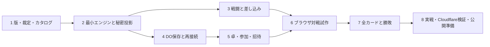

# 魔導戦記オンライン Implementation Plan

> **For agentic workers:** REQUIRED SUB-SKILL: Use superpowers:executing-plans to implement this plan task-by-task. Steps use checkbox (`- [ ]`) syntax for tracking. This document is a planning deliverable; it does not authorize implementation or deployment by itself.

**Goal:** 卓の作成・参加・招待から、秘密情報を守った複数人対戦、再接続、勝敗確定までをCloudflareで提供する。

**Architecture:** 1卓1Durable Objectを正本とし、WebSocketで個人別の状態を同期する。ルールはI/Oから独立したTypeScriptエンジン、卓の検索とセッションはD1、配信用画像はR2を候補とする。

**Tech Stack:** TypeScript、React、Vite、Workers、SQLite-backed Durable Objects、D1、R2、Vitest、Workers向けVitest環境、Playwright、pnpm。

**Spec:** [設計案](../specs/2026-09-07-online-game-design.md)。併読: [ルール整理とR01-R12](../../rules/analysis.md)、[素材索引](../../../resources/README.md)。

## Global Constraints

- デプロイ先はCloudflare。
- 試合の正本は1卓1Durable Objectの永続ストレージ。
- 第2版と3rd Ed.を無断で混在させない。
- 秘密情報はサーバーで参加者別に投影してから送信する。
- 紙にない優先権と期限処理はオンライン裁定として明示する。
- 初期版は明示的なパスを使い、切断を自動敗北や自動パスにしない。
- ゲーム状態・未解決処理・乱数結果は再接続で復元できる形で保存する。
- 初回はユーザー決定済みの2nd。実装中の検証結果は `docs/implementation-progress.md` に記録する。

---

## 現在地と順序

2026-09-08追記: 現在の再開地点と残工程の順序は[残工程の改訂計画](2026-09-08-completion-plan.md)を参照する。本書は原計画と既存要件の記録として保持する。Task7yは現在ソースの照合と受け入れが残り、過去のテスト成功件数を現在の完成状態と読み替えない。

原本5点と3rd展開索引に加え、2ndの行動220枚・人物26枚・110能力を目視校正し、[全仕様と裁定案](../../rules/second-edition/README.md)を作成済み。32件の受け入れ例とカタログ検証スクリプトもある。計画作成時点のJSONは文章仕様で、効果ハンドラーとゲームテストは別作業とした。2026-09-08に補完裁定を試作の基準として暫定採用し、現在は限定カードの通信・対戦基盤を経てTask7の全効果へ拡張中。最新の合格範囲と残作業は[実装進捗](../../implementation-progress.md)を参照する。3rd共通ルール不足は今回の2nd実装を妨げない。



4と5の通信/卓管理部分はダミー状態でも検証できる。カード効果は暫定採用した裁定版を基準に実装する。今後の見積もりはカード例外と裁定の量に大きく依存するため、まず1-3で難易度を測り、6の試作完了時点で残作業を再見積もりする。

完成までを以下の単位に分け、各単位をレビュー・検証できる形で実装する。コード例は将来作るAPIの受け入れテスト例であり、現在実行済みのテストではない。

## 2026-09-08 計画レビューの反映

暫定裁定の採用で仕様レビュー待ちは解消した。残る主な懸念と検証の順序は次の通り。

| 懸念 | 確認する工程と具体的な対応 |
|---|---|
| 割り込みのたびに全員がパスすると対戦が遅い | Task 6で6–8人による短い戦闘を先に実施。1攻撃の窓数・パス回数・判断時間・待ち時間を記録。自動パスはその結果で設計し、手札から推測した自動スキップで秘密を漏らさない |
| 個別カードが動いても組み合わせが破綻する | Task 3で多段×反撃×従者と割り込み中の補充を先に固定乱数で検査。Task 7で無効化×能力、死亡×復活×陣営変化を追加。再現用fixtureを残す |
| 対戦状態が保存されても本人が席へ戻れない場合がある | Task 5–6で再読込・一時切断・卓主切断を確認。Cookie削除/別端末は現行ゲスト方式の復旧対象外と明記。同じ表示名や招待URLだけで他人の席を引き継がせない |
| 2ndの画像が画面で読みにくい | Task 1で2nd PDFから代表カードを画像化し、Task 6で多段文面・小さい文字・人物能力をタブレットでも拡大確認。3rd素材を代用しない。配信条件・クレジット確認は既存Task 8で追跡 |

このレビューに伴う新しい裁定承認待ちはない。Task 6の操作感の確認を終えてからTask 7の全効果へ広げ、問題があれば裁定版またはUIを更新する。初期試作は指定した少数カードによる検証用の戦闘で、正式デッキの通し対戦とは区別する。

## 作成する構成

```text
apps/
  web/src/
    lobby/                    卓一覧・作成
    room/                     待機室・招待・準備完了
    game/                     盤面・手札・反応パネル・ログ
    connection/               WebSocketと再同期
  worker/src/
    index.ts                  HTTPS/WS入口
    auth.ts                   ゲストセッションとOrigin検証
    rooms/room.ts             卓DOの境界
    rooms/storage.ts          正本・イベント・コマンド保存
    rooms/outbox.ts           D1への冪等投影
    rooms/directory.ts        卓一覧
    rooms/invites.ts          招待トークン
packages/
  engine/src/
    state.ts                  保存可能な状態とID
    commands.ts               ゲームへの意思入力
    transition.ts             入力検証と状態遷移
    setup.ts                  配役・山札・初期処理
    view.ts                   参加者別の投影
    turns.ts                  フェイズと補充
    combat/                   進撃・攻撃・反撃・従者・複数対象
    reactions/                優先権・パス・中断・再開
    effects/                  型付き効果ハンドラー
    victory.ts                陣営・死亡・流浪・復活・勝敗
  protocol/src/               メッセージ型、入力スキーマ
  catalog/src/                版別の校正済み定義・デッキリスト
tests/e2e/                    独立ブラウザによる対戦
docs/rules/                   版別裁定、シナリオ、出典
```

原本XMLの座標・ダメージカウンター値・並び順は初期ゲームに流用しない。原本の入手経路と索引は、実装後も `resources/` に残す。

## Task 1: 対象版と裁定を固定し、検証用カタログを作る

**Files:**

- Create: `docs/rules/selected-ruleset.md`, `docs/rules/rulings.md`, `docs/rules/scenarios.md`
- Create: `packages/catalog/src/types.ts`, `packages/catalog/src/selected/index.ts`, `packages/catalog/src/selected/deck.json`
- Test: `packages/catalog/test/catalog.test.ts`
- Modify: `docs/rules/analysis.md` のR01-R12

**入力:** 原本、版別の目視/OCR結果、ユーザーが選んだ版。**出力:** 版ID、根拠付きの裁定、検証用の部分デッキ、正式デッキの校正状況。

- [x] 初回の対象版を2ndに固定する（ユーザー決定）。
- [x] 原典の220行動カード・26人物・110能力を転記し、全ページを目視校正する。JSONは `data/second-edition/`。
- [x] 共通裁定、全カードの疑問への回答案、32件の受け入れシナリオを作る。原文と補完を分ける。
- [x] カタログの枚数・全セル・ID・別名・参照・質問収録を `scripts/validate_second_edition.py` で検査する。
- [x] 重点6項目を含む推奨裁定を `second-online-v0.1-provisional` として暫定採用する（2026-09-08ユーザー了解）。裁定内容は変更せず、採用状態を更新。
- [x] 2nd PDFから配信用画像を生成し物理IDへ対応付ける。3rd JPGを代用しない（246枚、出典/画像ハッシュ照合、7テスト、独立レビュー済み）。
- [ ] 文章仕様を型付きの効果・対象・コスト・終了条件へ変換し、未実装状態を保持する。
- [ ] 試作範囲は通常の踏み込み/剣、間合い/休息、見切る、転移、受け流し、ゴブリン、祝福、命運凶変、沈黙を含める。多段は天地百撃斬、反射はミラーシールドで追加する。人物能力は初めに制限を含む全状態をモデル化し、小群ずつ実装する。
- [ ] 32件を固定状態・固定乱数のfixtureと期待状態に落とし込み、効果の正常系/不使用/失敗/取消/重複入力テストを追加する。
- [ ] 実装カタログの型検査とテストを作り、画像欠落・出典なし・未実装効果の本番デッキ混入を拒否する。

定義契約の要点:

```ts
type SourceRef = {
  path: string;
  page?: number;
  imageId?: string;
  verified: boolean;
};
type CatalogEntry = {
  id: string;              // 版を含む意味上のID
  edition: "second" | "third";
  name: string;
  source: SourceRef;
  assetId: string;
  copies: number;
  implementation: "pending" | "tested";
};
```

受け入れ例:

```ts
expect(entries.every(c => c.source.verified)).toBe(true);
expect(new Set(entries.map(c => c.id)).size).toBe(entries.length);
expect(deck.reduce((n, row) => n + row.copies, 0)).toBe(ruleset.actionCardCount);
expect(new Set(entries.map(c => c.edition))).toEqual(new Set([ruleset.edition]));
```

`entries`, `deck`, `ruleset` はこのタスクで作る `selected/index.ts` のエクスポートとする。`actionCardCount` は2ndで原典とカタログを照合した220。3rdの219とは混在させない。

**検証:** `pnpm --filter @madou/catalog test`。不足する正式情報は `rulings.md` にIDと影響機能を残し、その機能を本番有効にしない。作業単位ごとに校正結果とテストをコミットする。

## Task 2: 純粋エンジンの最小経路と秘密情報の投影

**Files:**

- Create: `package.json`, `pnpm-workspace.yaml`, `tsconfig.base.json`, `pnpm-lock.yaml`
- Create: `packages/engine/src/state.ts`, `commands.ts`, `transition.ts`, `setup.ts`, `view.ts`
- Create: `packages/protocol/src/messages.ts`, `validation.ts`
- Test: `packages/engine/test/setup.test.ts`, `view.test.ts`, `fixtures.ts`
- Create: `packages/engine/test/fixtures/basic-four-player.json`

**入力:** Task 1のルールセット・カタログ。**出力:** 初期配布、次の入力待ち、本人別の状態、固定乱数で再現できるAPI。

エンジンの契約はこのタスクで定義し、後続も同じ名前を使う:

```ts
transition(state: GameState, input: GameInput, entropy: Entropy): TransitionResult
viewFor(state: GameState, viewerId: PlayerId): PlayerView
```

`GameInput` は認証済み `actorId` とコマンドを持つ。`TransitionResult` は成功時 `{ ok: true, state, events }`、失敗時 `{ ok: false, code }`。`Entropy` は固定時刻と乱数列/読み出し関数の入力境界。状態自体に関数を保存しない。テスト用 `loadFixture(name)` は同名JSONの新しいコピーを返す。

- [x] `@madou/catalog`、`@madou/engine`、`@madou/protocol` をworkspace化し、対応する型検査・testコマンドを設定する。
- [x] 初期配布の人数、陣営数、変身除外、カード保存則の失敗テストを書く。
- [x] 配役・山札・手札・初期OPEN/従者の処理を、Task 1で決めた順序で実装する。
- [x] `viewFor` を許可リスト方式で実装し、秘密のキャラクターID・他人の手札ID・山札順がレスポンスにないことを検査する。
- [x] `JSON.stringify/parse` した状態から同じ入力が同じ結果になることを確認する。

```ts
const state = loadFixture("basic-four-player");
const forA = viewFor(state, "A");
const serialized = JSON.stringify(forA);
for (const secretId of state.players.B.hand) {
  expect(serialized).not.toContain(secretId);
}
expect(serialized).not.toContain(state.players.B.characterId);
expect(forA.players.B.handCount).toBe(5);
expect(forA.self.hand).toHaveLength(5);
```

上例に合わせ `players` はIDキーのレコード、`hand` はカードインスタンスID配列として定義する。`PlayerView` には他者の配列を含めず `handCount` を使う。

**検証:** `pnpm --filter @madou/engine test` と `pnpm typecheck`。UI/Workerの依存を入れずにパスすること。最小契約をコミットする。

## Task 3: 1つの戦闘を中断・再開できるようにする

**Files:**

- Create: `packages/engine/src/turns.ts`
- Create: `packages/engine/src/combat/attack.ts`, `defense.ts`, `followers.ts`, `distance.ts`, `hits.ts`
- Create: `packages/engine/src/reactions/windows.ts`, `continuations.ts`
- Create: `packages/engine/src/effects/registry.ts`
- Test: `packages/engine/test/combat.test.ts`, `reactions.test.ts`, `multi-hit.test.ts`
- Create: `packages/engine/test/fixtures/follower-defense-started.json`, `third-party-interrupt.json`, `multi-target-multi-hit.json`

**入力:** `transition`、Task 1の裁定。**出力:** 進撃→攻撃→防御/反撃→従者→ダメージ→撤退の状態遷移と反応要求。

- [x] 選定した通常攻撃と反撃の期待結果をテストにし、失敗を確認する。
- [x] 使用Lv、効果Lv、ダメージ、射程を分離して計算する。
- [x] 窓ごとの優先権とパス、第三者介入、介入に伴う即時補充、再開先をデータとして実装する。
- [x] 従者受け開始後の防御側による通常防御を拒否し、前後順・士気・Lv比較を実装する。
- [x] 複数対象と複数ヒットを別配列で保持し、共有する踏み込みとヒットごとの防御を検証する。
- [x] 回復・停止・任意ドロー・詠唱・従者配置・手札調整を接続し、全員パスしたまま停止する窓がないことを確認する。

```ts
const state = loadFixture("follower-defense-started");
const result = transition(state, {
  actorId: "B",
  command: { type: "PLAY_DEFENSE", cardInstanceId: "B-defense-1" }
}, { now: 0, dice: [] });
expect(result).toEqual({ ok: false, code: "DEFENSE_WINDOW_CLOSED" });
```

`B-defense-1` は本人が所有し、それ以外の使用条件を満たす防御札にする。「手札なし」で誤ってパスするテストにしない。追加シナリオは、同値反撃による相殺、高Lv反撃の返り攻撃、遠距離での近距離反撃、失敗した防御後の別手段、従者受け前後の同陣営公開、ダメージ0の公開を含める。

**検証:** `pnpm --filter @madou/engine test`。中断中の状態をJSON保存→復元して各シナリオが同じ結果になる。戦闘・反応・複数ヒットは別コミットにする。

## Task 4: 卓DO、永続化、WebSocket、再接続

**Files:**

- Create: `apps/worker/package.json`, `wrangler.jsonc`, `vitest.config.ts`
- Create: `apps/worker/src/index.ts`, `rooms/room.ts`, `rooms/storage.ts`, `rooms/outbox.ts`
- Test: `apps/worker/test/room-storage.test.ts`, `room-websocket.test.ts`, `room-recovery.test.ts`

**入力:** `GameState`、`GameInput`、`TransitionResult`、`viewFor`。**出力:** 接続復元可能な1卓の実行環境。

- [x] [Workers向けVitest環境](https://developers.cloudflare.com/workers/testing/vitest-integration/) を設定し、独立ストレージでDOを起動するテストを作る。
- [x] 同一commandIdの再送、古いrevision、同時受付で失敗するテストを書く。
- [x] SQLiteの状態、イベント、処理済みコマンド、Outboxの保存を同じトランザクションにまとめる。
- [x] 保存後ACK、`acceptWebSocket()`、attachmentと永続席情報からの復帰を実装する。
- [x] 保存前・保存後ACK前・broadcast中の故障を注入する。ゲーム内の乱数とカード消費が一度だけ確定することを検証する。
- [x] D1反映を失敗させ、Outboxの再送と版番号比較で最終状態へ追いつくことを確認する。

このタスクで提供するテストハーネス `openTestRoom(fixtureName)` は、`command(envelope)`, `restart()`, `snapshotFor(playerId)` を持つ。実際のDO境界を呼び、内部メモリの直接書き換えでテストを済ませない。

```ts
const room = await openTestRoom("third-party-interrupt");
const request = {
  commandId: "repeat-1", expectedRevision: 10,
  windowId: "defense-1", windowRevision: 1, type: "PASS"
};
const first = await room.command(request);
await room.restart();
const retry = await room.command(request);
expect(retry).toEqual(first);
expect((await room.snapshotFor("A")).revision).toBe(first.revision);
```

ハーネスの接続は認証済みAで開始し、fixtureのrevision/窓IDを上例と一致させる。再起動はメモリを破棄して永続ストレージから復元する。

**検証:** `pnpm --filter @madou/worker test`。Hibernation・実デプロイ後の再接続はTask 8でも確認する。DO基盤をコミットする。

## Task 5: 卓の募集・参加・招待・開始

**Files:**

- Create: `apps/worker/src/auth.ts`, `rooms/directory.ts`, `rooms/invites.ts`
- Create: `apps/worker/migrations/0001_sessions_rooms.sql`
- Modify: `apps/worker/src/index.ts`, `rooms/room.ts`, `rooms/outbox.ts`
- Test: `apps/worker/test/lobby.test.ts`, `invites.test.ts`, `auth.test.ts`

**入力:** Task 4の卓DO。**出力:** 以下のHTTP APIと卓管理コマンド。

| 接点 | 役割 |
|---|---|
| `POST /api/sessions` | 表示名からゲストセッションを作成 |
| `GET /api/rooms` | 募集中の公開卓を一覧取得 |
| `POST /api/rooms` | 版・人数・公開範囲を指定して作成 |
| `POST /api/rooms/:id/join` | 公開参加または招待トークンを検証して着席 |
| `POST /api/rooms/:id/invites` | 卓主がトークンを作成/再発行 |
| `GET /api/rooms/:id/ws` | CookieとOriginを検証して接続 |
| `READY`, `START`, `LEAVE`, `CLOSE_BY_AGREEMENT` | 卓DOで権限・人数・準備状態を検証 |

- [ ] 定員を超える同時join、無効/旧招待、別卓のセッション偽装、二重startの失敗テストを書く。
- [ ] Cookieセッションとサーバー側の行為者確定、接続世代、Origin検証を実装する。
- [ ] DOで席を確定し、D1へ公開卓だけを投影する。招待トークンはURLに表示するとき以外はハッシュで扱い、アクセスログにも残さない。
- [ ] 準備完了と開始の条件、設定変更時の準備解除、募集時の卓主移譲を実装する。
- [ ] 途中参加拒否、本人の復帰、同一人物の重複着席拒否を確認する。

```ts
// 4人卓で既に3人着席済み。joinAsは独立CookieのHTTP参加リクエスト。
const results = await Promise.all([joinAs("D"), joinAs("E")]);
expect(results.map(r => r.status).sort()).toEqual([200, 409]);
expect((await publicRoomView()).occupiedSeats).toBe(4);
```

`joinAs` と `publicRoomView` はこのタスクのfixture付きHTTPテストヘルパー。401/403/409/400の区別をAPI契約に記録し、秘密情報を含む拒否理由は返さない。

**検証:** `pnpm --filter @madou/worker test`。公開・招待限定の各経路で4セッションが開始まで到達する。募集機能をコミットする。

## Task 6: ブラウザで少数カードの対戦を通す

**Files:**

- Create: `apps/web/package.json`, `vite.config.ts`, `src/main.tsx`, `src/App.tsx`
- Create: `apps/web/src/lobby/Lobby.tsx`, `room/WaitingRoom.tsx`
- Create: `apps/web/src/game/Board.tsx`, `Hand.tsx`, `ReactionPanel.tsx`, `PublicLog.tsx`, `CardDialog.tsx`
- Create: `apps/web/src/connection/client.ts`, `session.ts`
- Test: `tests/e2e/invite-game.spec.ts`, `reconnect.spec.ts`, `privacy.spec.ts`

**入力:** Task 5のAPI、`PlayerView`、Task 3の反応要求。**出力:** 招待→対戦開始→一連の戦闘→再接続まで触れる検証版。

- [ ] 独立した4つのブラウザcontextを用意し、招待→準備→開始のE2Eを失敗させる。
- [x] 卓一覧、待機室、配役、手札、相手の公開情報を実装する。
- [x] 攻撃対象と宣言値を確認する画面、反応/パスの操作、回答待ちの表示を実装する。
- [x] 従者・詠唱・強化領域を分け、カードを拡大して効果全文を読めるようにする。
- [x] 再接続中は操作を保留し、再同期後の候補に置き換える。未ACKの再送には同じcommandIdを使う。
- [ ] keyboard/touchでカード確認、対象選択、パスができ、手札変更でフォーカスを失わないことを手動確認する。
- [ ] 6–8人で少数カードの戦闘を試し、通常攻撃・第三者介入・多段反撃の各1回について、窓数、パス回数、判断時間、待ち時間、操作を迷った箇所を記録する。全カード追加前に反応画面を修正する。

```ts
await pages.B.getByRole("button", { name: "パス", exact: true }).click();
await expect(pages.A.getByRole("status")).toContainText("Cさんの判断を待っています");
await pages.B.reload();
await expect(pages.B.getByRole("region", { name: "自分の手札" })).toBeVisible();
```

`pages` は各自のcontextと表示名を持つfixture。この表示順はTask 1で選んだオンライン優先順に合わせる。DOMだけでなくHTTP/WS本文も収集し、他人の手札や秘密IDがないことを検査する。

**検証:** `pnpm exec playwright test tests/e2e/invite-game.spec.ts tests/e2e/reconnect.spec.ts tests/e2e/privacy.spec.ts`。この時点の成果は一部カードによる検証版で、原作の通し対戦完成とはしない。UIをコミットする。

## Task 7: 全カード、個人能力、陣営変化、勝敗

**Files:**

- Modify: `packages/catalog/src/selected/index.ts`, `deck.json`
- Create: `packages/engine/src/effects/techniques.ts`, `specials.ts`, `characters.ts`, `statuses.ts`
- Create: `packages/engine/src/victory.ts`
- Test: `packages/engine/test/effects/*.test.ts`, `victory.test.ts`, `invariants.test.ts`
- Create: `docs/rules/coverage.md`

**入力:** 校正済みの全定義、Task 1の裁定とシナリオ。**出力:** 採用版の正規構成による通し対戦。

- [ ] カードごとに出典・ハンドラー・テスト・校正状況を `coverage.md` に対応付ける。
- [ ] 通常技→防御/反撃→従者→OPEN/特殊→キャラクター能力→変身/勝敗を小群に分けて増やし、各小群で赤→緑のテストを行う。直接攻撃の追加後、抵抗・士気・状態回復を増やす前に、G04/G07の判定前・出目後の保存可能な継続処理を共通化する。相互依存する死亡・復活などは、個別効果に先立って共通の処理順を実装する。
- [ ] 任意能力の不使用、強制制限、持ち技回収、キャラクター限定修正のタイミングを実装する。
- [ ] 死亡と流浪のカード返却先、復活時の陣営、保護対象復活時の流浪解除、停止と異界の違いを実装する。
- [ ] 個人の目的と現在陣営による終了を実装し、R09の同時死亡/変身/復活シナリオで検証する。
- [ ] 山札・手札・場・捨て札を通じたカード保存則、同じカードの二重所属禁止、解決終了後の残留窓禁止を性質テストで確認する。

```ts
const allIds = allCardInstanceIds(state); // このタスクのテストヘルパー
expect(new Set(allIds).size).toBe(allIds.length);
expect(allIds.sort()).toEqual(initialCardInstanceIds.sort());
expect(productionEntries.every(c => c.implementation === "tested")).toBe(true);
```

`allCardInstanceIds` は解決途中の予約済みカード領域も含め、ゲーム外保管の変身カードは別に数える。復活や流浪で増殖・消失しないことを検査する。

**検証:** `pnpm --filter @madou/engine test` とカタログ照合。全カードを一括コミットせず、効果群と対応テストを小分けにする。`pending` がある正式デッキは有効化しない。

## Task 8: 通し対戦、Cloudflare検証、運用準備

**Files:**

- Modify: `apps/worker/wrangler.jsonc`
- Create: `docs/operations/deploy.md`, `recovery.md`, `playtest-results.md`
- Create: `tests/e2e/full-game.spec.ts`, `failure-recovery.spec.ts`
- Create: `scripts/prepare_assets.py`（必要な配信用変換のみ）

**入力:** Task 7の完成候補。**出力:** 通し対戦と復旧を検証したデプロイ可能なビルド。

- [x] 以下の受け入れ表を自動テストと人の実戦に振り分ける。[実施手順](../../operations/playtest-guide.md)へ記録。実施結果は別途必要。
- [ ] 画像の利用条件・クレジット・配信範囲を確定し、検証済み素材だけを出力する。原本ZIPは配信しない。
- [ ] ローカルで `pnpm typecheck`、`pnpm test`、`pnpm exec playwright test`、`pnpm build` を通す。
- [ ] Cloudflare用のbindings、DO migration、D1 migration、環境分離、旧ルール版保持の設定を用意する。秘密値はソース管理しない。
- [ ] デプロイを実行する段階では、その時点のユーザーの依頼範囲に従い、対象環境・構成・ビルド・確認済み項目を具体的に示す。今回の計画作業では外部リソースを作成しない。
- [ ] 検証環境でDO休止/復帰、保存後ACK前の再接続、D1投影失敗、再デプロイ中の進行試合を確認する。
- [ ] 8人の通し対戦を複数回実施し、反応窓の回数、回答待ち時間、全員パスに要する操作数、例外裁定を記録する。
- [ ] 10人×10卓を検証目標としてメッセージ遅延と課金メトリクスを測る。実測値と試験条件を保存する。

| シナリオ | 合格条件 |
|---|---|
| 公開/招待限定卓、同時参加 | 非公開卓の漏れと過剰着席がない |
| 異なるブラウザ4/6/8/10人 | 全員が本人の状態だけを受信する |
| 踏み込み↔間合い、反撃連鎖 | 裁定どおりに終わり、消費・距離が一致 |
| 第三者介入とその補充 | 元の処理へ正しい位置から復帰する |
| 全体攻撃+複数ヒット | 共有カードと個別防御を混同しない |
| 従者受け前後の公開 | 境界後の通常防御を許可しない |
| 任意能力を使わない | サーバーが能力を自動適用/暴露しない |
| 停止、異界、死亡、流浪、復活 | 行為可能範囲とカード移動・陣営が一致 |
| ホスト切断、全員切断 | 保存から同じ試合を再開できる |
| ACK喪失、二重送信、複数タブ | 操作が二重確定されない |
| 古い画面/窓からのコマンド | 拒否後に最新状態へ同期する |
| D1障害、旧投影の遅延到着 | 卓DOは進行可能、一覧は最新へ収束する |
| 非互換ルール更新 | 進行中の試合は開始時の版のまま |

**検証:** 自動テストの結果と実戦記録を `playtest-results.md` へ保存する。検証環境の合格後に公開環境のリリースを判断する。時間制限付きモードはこの完成条件に含めない。

## 今回の調査・計画の検証

- 原本5点と展開ファイル221点をSHA-256で検証する。
- カード245枚の表裏参照と209表面の複製数を照合する。
- 再取り込みが既存原本を変えず、同じ索引になることを確認する。
- 文書内リンク、版の区別、原作確定/オンライン案の区別を確認する。
- 原本取り込みと全カードの目視校正は完了。補完裁定の承認、ゲーム実装、効果テスト、デプロイも完了したと誤読されないことを確認する。

実装進捗の正本は `docs/implementation-progress.md`。Task2-4の限定カード基盤とTask6の自動ブラウザ検証が進み、Task7で効果群を追加中。Task1の全効果契約・32シナリオ、人間の実戦、正式開始、配備は残っている。未実装の効果や未検証の組み合わせを完成扱いにしない。
