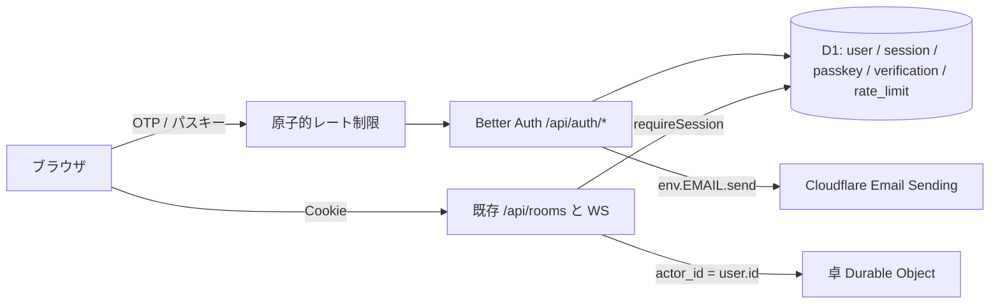

# アカウント登録（メールOTP + パスキー） Implementation Plan

> **For agentic workers:** REQUIRED SUB-SKILL: Use superpowers:executing-plans to implement this plan task-by-task. Steps use checkbox (`- [ ]`) syntax for tracking. This document is a planning deliverable; it does not authorize production deploy by itself.

**Goal:** 表示名だけのゲストを廃止し、メールアドレスでユーザー登録した人だけが卓に着席できるようにする。新しい端末では6桁コード、同じ端末ではパスキーと自動延長Cookieで戻れる。

**Architecture:** 卓DO・エンジン・席の `actor_id` は維持する。恒久IDは Better Auth の `user.id` とし、既存 `requireSession` が `{ id: user.id, name: user.name }` を返す。認証HTTPは `/api/auth/*`。その手前に D1 の原子的レート制限を置く。メール送信は Cloudflare Email Service の Workers binding。

**Tech Stack:** Better Auth（D1、`emailOTP` + `@better-auth/passkey`）、Cloudflare Workers / D1 / Email Sending、既存の React + Vitest + Playwright。Drizzle / Hono / Mailpit は入れない（魔導戦記の薄い Worker に合わせ、irori から方針だけ移す）。

**Spec:** 本計画。OTP防御の根拠は irori の [Email OTP 設計](https://github.com/mc-chinju/online-office) `docs/superpowers/specs/2026-08-23-email-otp-login-design.md`。背景は [オンライン設計](../specs/2026-09-07-online-game-design.md) の「恒久アカウントは後段」。

**Worktree:** `/Users/chinju/git/madou-senki-worktree-account-auth`、ブランチ `worktree-account-auth`。実装はこの worktree で行い、タスクごとにコミットする。main への merge はユーザーが行う。

## 現状の訂正

このリポジトリに Better Auth は入っていない。いまの認証は自前のゲストCookie（`POST /api/sessions` + D1 `sessions`）だけである。本計画で Better Auth を新規導入し、ゲスト経路を削除する。

現行公開 origin は `https://madou-senki.catalgorithm.workers.dev`。独自ドメイン取得後はそちらを正とし、パスキーの `rpID` もホスト名に合わせる。ゲストCookieで着席中の卓は、この変更の配備後に復帰できない。招待制プレイテストの破壊的変更として文書化する。

## irori から取り入れるもの / 入れないもの

取り入れる（本番で踏んだ穴と、そのまま使える型）:

- OTP は **6桁・5分・試行3回・D1にはハッシュだけ**。`type === 'sign-in'` 以外は送らない
- Better Auth のレート制限は Workers では黙って切れる。`rateLimit.enabled: true` と `storage: 'database'` を明示する
- IP は `cf-connecting-ip` だけ。`x-forwarded-for` を併記しない（先頭が詐称できる）
- 内蔵カウンタは並列で抜ける。**handler 前段の原子的 D1 upsert を主ガード**にする
- 同一メールの send/verify は lease で直列化する。D1 障害は **503 fail-closed**
- 送信失敗なら send 回数を払い戻す。未使用の OTP 経路（パスワード再設定など）は 404
- `verification.identifier` を UNIQUE にする（再送で古いコードが残らない）
- `rate_limit.last_request` は integer。timestamp モードにしない
- メール送信は 5 秒で打ち切る。binding の `allowed_sender_addresses` と `EMAIL_FROM_ADDRESS` を一致させる
- 本文は HTML エスケープし、URL を入れない。クライアントは `{ data, error }` を見る（throw しない）
- ログインUIはメール → 6桁の2段階。単一 input、`one-time-code`、再送は60秒
- 大量 e2e はログイン画面を踏まず、localhost 限定の試験用セッション発行を使う（irori の `/api/test/session` 相当）

入れない:

- Drizzle / Hono / Mailpit / Zustand。既存の SQL migration・fetch・薄い React を維持する
- 招待メール共通化、PWA、Realtime 秘密
- irori が後回しにしたパスキーは、こちらでは入れる

## Global Constraints

- パスワードは作らない。`emailAndPassword` は無効。
- ゲスト・匿名プラグインは使わない。未ログインではロビーも卓参加も拒否する。
- 試合の正本・秘密投影・WebSocketの `X-Room-Actor` は今どおりサーバーがセッションから決める。
- 魔導戦記は確認フェーズが多く、手番メールの非同期対戦にはしない。送信するメールはログイン用OTPだけ。
- 他ゲーム用プラットフォームへの切り出しはしない。アカウントIDがゲーム非依存であることだけ保証する。
- 本番に `__test`・試験用セッション・固定OTP・OTPのレスポンスエコーを置かない。
- OTP本文・Cookie・`AUTH_SECRET` をGit・証跡・ログに残さない。
- Cloudflare Email Sending は Cloudflare DNS の独自ドメインが必要。`*.workers.dev` からは送れない。ドメイン onboard はコードと別に人が行う。未設定でもローカル試験は通す。

## 採用する動き



1. メールを入れる。初回は表示名も入れる。
2. 6桁コードを送る。有効5分、試行3回。同一メールは60秒に1通。
3. コードが正しければセッションCookieを発行する。未登録ならここでユーザーを作る。
4. ログイン後、この端末へパスキー登録を勧める（スキップ可）。次回はパスキー、だめならまたコード。
5. メール欄では Conditional UI（`autocomplete="username webauthn"`）を有効にする。

### Cookie の自動延長

Better Auth の `expiresIn` / `updateAge` を使う。

| 項目 | 値 | 意味 |
|---|---|---|
| `expiresIn` | 30日 | Cookie と D1 セッションの寿命 |
| `updateAge` | 10日 | 前回更新から10日経ったアクセスで、寿命を「今+30日」へ伸ばす |

残り20日を切ったら延長、と同値。2週間に一度でも来ればログインは切れない。D1書き込みはユーザーあたり高々3回/月。30日アクセスがなければ再認証。毎リクエストでは延長しない。

Better Auth はセッションCookieに `__Host-` を付けられない（[issue 11061](https://github.com/better-auth/better-auth/issues/11061)）。代わりに `__Secure-madou.session_token`（`cookiePrefix: "madou"`、`Path=/`、`HttpOnly`、`Secure`、`SameSite=Lax`、`Domain` なし）を使う。ゲストの `__Host-madou_session` は廃棄する。

### 表示名

卓で見える名前は `user.name`。メールとは別。24文字・NFC・制御文字なしは現行 `displayText` と同じ。一意にする。既存ユーザーの再ログインでは名前を上書きしない。

### OTP とレート制限

| 項目 | 値 |
|---|---|
| 桁数 | 6 |
| 有効期限 | 300秒 |
| `allowedAttempts` | 3 |
| `storeOTP` | `hashed` |
| 送信 | メールあたり60秒に1回 |
| 検証 | そのOTP世代あたり5分で3回 |
| IP | エンドポイントあたり60秒に10回（`cf-connecting-ip`） |
| 再送 | 旧コード無効（identifier UNIQUE） |

6桁は探索空間が 10^6 しかない。Better Auth 内蔵の read-modify-write は並列で抜けるため、主ガードは前段の単一 SQL（`INSERT ... ON CONFLICT ... DO UPDATE ... RETURNING`）とする。カウンタ障害では認証を進めず 503。ローカル `wrangler dev` には `cf-connecting-ip` が無いので、メール単位の制限が常に効くことを試験する。

### 試験用セッション

既存 e2e は約2000本あり、毎回OTP画面を踏まない。Playwright 専用 Worker にだけ、irori の `/api/test/session` 相当の **localhost 限定**セッション発行を置く。ログイン画面とパスキーは専用スペック1本ずつ。本番 Worker にはこの経路を export しない。

---

## ドメイン（人が取る）

推奨は **`madou-senki.com` を Cloudflare Registrar で取る**こと。

- ゲーム名そのもので、メールの `noreply@madou-senki.com` が信頼されやすい
- Cloudflare Registrar の `.com` は卸値のまま（2026年9月時点で年約 $10.44。11月の Verisign 値上げ後も約 $11 前後の見込み）。登録費＝更新費で、2年目に跳ねない
- WHOISプライバシー込み。DNS が同じアカウントなので Email Sending の SPF/DKIM onboard が短い
- Namecheap 等の「初年度安い→更新が高い」より、毎年の実費はこっちが安い

他TLD:

| 候補 | 更新の目安 | 判断 |
|---|---|---|
| `.com` | 年約 $10–12 | 本命。取る |
| `.jp` | 年3,000円前後〜 | 日本向けには良いが、Email/パスキー/海外友人には `.com` の方が無難 |
| `.dev` / `.app` | 年 $12–20 前後 | HTTPS強制で技術的には良いが、名前が長い |
| `.game` | 高いことが多い | ゲームらしいが毎年高い |
| `.xyz` など格安TLD | 安い | ログインメールが迷惑メール扱いになりやすい。使わない |

将来プラットフォーム化するなら別ドメインを足せばよい。今は魔導戦記単体なので `madou-senki.com` で足りる。防御用に `.net` まで取る必要はない。

ホスト案（irori の `app.irori.space` / `app-stg.irori.space` / `noreply@irori.space` に合わせる）:

| 用途 | ホスト |
|---|---|
| production | `https://madou-senki.com`（www は apex へ） |
| staging | `https://staging.madou-senki.com` |
| 送信元 | `noreply@madou-senki.com` |
| パスキー rpID | そのリクエストのホスト名（localhost / staging / apex） |

`workers.dev` は予備のまま残してよいが、Cookie とパスキーの正はカスタムドメインにする。

コード外（この計画の実装完了条件にしない）:

1. Cloudflare Registrar で `madou-senki.com` を登録・自動更新
2. Worker にカスタムドメインを付ける（production / staging）
3. Email Sending にドメインを onboard し、SPF/DKIM を確認
4. `wrangler secret put AUTH_SECRET --env staging` と production

---

## Task 0: Better Auth の土台・OTP設定・レート制限

**Files:**
- Create: `apps/worker/src/auth/better-auth.ts`（`createAuth`。D1はリクエストごと）
- Create: `apps/worker/src/auth/rate-limit.ts`（原子的カウンタ + 同一メール lease。irori の service/repository を1ファイルに圧縮）
- Create: `apps/worker/src/auth/otp-email.ts`（件名・HTML/text。OTPはエスケープ。URLなし）
- Create: `apps/worker/src/auth/email-sender.ts`（5秒タイムアウトの `env.EMAIL.send`。結果は ok/fail だけ返す）
- Modify: `apps/worker/src/auth.ts`。`requireSession` は `{ id, name }` に写す。`createSession` 削除。`hashToken`（招待）は残す
- Create: `apps/worker/migrations/0002_better_auth.sql`（user / session / account / verification / passkey / rate_limit。`verification.identifier` UNIQUE。旧 `sessions` は DROP）
- Modify: `apps/worker/package.json`（`better-auth`、`@better-auth/passkey`）
- Modify: `apps/worker/wrangler.jsonc`（`ENVIRONMENT`、`BASE_URL`、`EMAIL_FROM_ADDRESS`。ローカル `AUTH_SECRET` は vars。staging/production は secret）
- Modify: `apps/worker/src/index.ts`（レート制限のあと `/api/auth/*`。未使用OTP経路は404。`POST /api/sessions` 廃止。`GET /api/sessions/current` は残す）
- Modify: `apps/worker/test/auth.test.ts` / `lobby.test.ts`

**Interfaces:**
- 卓が読む `Session` は `{ id: string; name: string }`。`id` は `user.id`
- `emailAndPassword.enabled: false`
- `emailOTP`: `otpLength: 6`, `expiresIn: 300`, `allowedAttempts: 3`, `storeOTP: 'hashed'`。`sign-in` 以外は送らない
- `session.expiresIn = 60 * 60 * 24 * 30`、`session.updateAge = 60 * 60 * 24 * 10`
- `rateLimit: { enabled: true, storage: 'database' }`
- `advanced.ipAddress.ipAddressHeaders: ['cf-connecting-ip']` のみ。`cookiePrefix: "madou"`
- `secret: env.AUTH_SECRET`（無ければ起動失敗）
- `baseURL` / `trustedOrigins` は `ENVIRONMENT` と `BASE_URL`（production は `BASE_URL` のみ）
- 表示名 UNIQUE。衝突は登録時 4xx
- レート制限: send 60秒1 / verify 世代あたり3 / IP 60秒10。lease 喪失や D1 失敗は 503。送信失敗は send を払い戻し `EMAIL_SEND_FAILED`

- [x] Better Auth をリクエスト単位で作り、ゲストINSERTを削除する
- [x] migration 0002 をローカル適用する
- [x] `requireSession` が Cookie から `{ id, name }` を返し、未ログインは 401 `UNAUTHENTICATED`
- [x] 並列20送信で許可1、並列20検証で許可3、OTP無し検証は handler に渡さない
- [x] 再送後は旧コードが失敗し、新コードだけ通る
- [x] `type` が `sign-in` 以外、および forget-password 経路は 404
- [x] 延長: 11日前相当の `expires_at` で `GET /api/sessions/current` すると Max-Age が付き、9日前相当では付かない
- [x] Worker 試験の `guest()` を「試験用にユーザー+Cookieを作る」ヘルパーへ

```bash
pnpm --filter @madou/worker exec wrangler d1 migrations apply DB --local --env= --persist-to ../../.cache/local-state
pnpm --filter @madou/worker exec vitest run test/auth.test.ts test/lobby.test.ts
```

---

## Task 1: ログイン画面とゲストUIの削除

**Files:**
- Create: `apps/web/src/auth-client.ts`（`emailOTPClient` + `passkeyClient`。`sendLoginCode` / `verifyLoginCode`）
- Create: `apps/web/src/login-error.ts`（`INVALID_OTP` / `OTP_EXPIRED` / `TOO_MANY_ATTEMPTS` / 429 / `EMAIL_SEND_FAILED` を日本語へ）
- Modify: `apps/web/src/App.tsx`（2段階フォーム。表示名はメール段階）
- Modify: `apps/web/src/session.ts`（`createSession` 削除）
- Modify: `apps/web/src/lobby/Lobby.tsx`（ログアウト）
- Modify: `apps/web/package.json`
- Modify: `apps/worker/test/fixtures/e2e-worker.ts`（localhost のみ `POST /__test/session`。本番入口から export しない）
- Modify: `tests/e2e/helpers.ts`（`tableFixture` は試験用セッション。OTP画面は踏まない）
- Create: `tests/e2e/login.spec.ts`（本物のOTP画面。試験Workerの固定OTPまたは捕捉した送信）

**ログイン画面:**
1. メール + 表示名（初回用。既存は無視される旨を短く）
2. 「確認コードを送信」→ 6桁（`inputMode=numeric`、`autoComplete=one-time-code`、単一欄）
3. 60秒クールダウンの再送、「別のメールアドレスを使用する」
4. better-auth クライアントは `{ data, error }` を見る。成功後に `getSession` してからロビーへ
5. メールの有無はユーザーへ漏らさない

- [x] 未ログインで `/` も `/rooms/:id` もログイン画面。着席APIは401
- [x] 初回: メール+表示名+OTP で `ようこそ、{name}さん`
- [x] 2回目: 同じメール+別表示名でも保存済み表示名のまま
- [x] 表示名の重複は登録できない
- [x] `tableFixture` は `/__test/session` 経由で既存シナリオが動く
- [x] `login.spec.ts` が画面からコード入力まで通る

```bash
pnpm --filter @madou/web typecheck
pnpm --filter @madou/worker exec vitest run test/auth.test.ts
pnpm exec playwright test tests/e2e/login.spec.ts tests/e2e/invite-game.spec.ts tests/remote/smoke.spec.ts
```

---

## Task 2: Cloudflare Email Sending とカスタムドメイン設定口

**Files:**
- Modify: `apps/worker/wrangler.jsonc`
  - `send_email: [{ name: "EMAIL", allowed_sender_addresses: ["noreply@madou-senki.com", "noreply@madou-senki.local"] }]`
  - staging/production は `noreply@madou-senki.com` のみ
  - vars: `EMAIL_FROM_ADDRESS`、`BASE_URL`（local `http://localhost:8787`、staging/production はカスタムドメイン。未取得の間は workers.dev のままでも型は合わせておく）
  - `remote: true` は付けない
- Modify: `docs/operations/deploy.md`（Email Sending onboard、`AUTH_SECRET`、カスタムドメイン、ゲストCookie無効）
- Worker 試験: `EMAIL.send` のフェイク。OTPはHTTP応答に出ない

- [x] `wrangler types` で `EMAIL` と `EMAIL_FROM_ADDRESS` を Env に出す
- [x] 送信は `from`/`to`/`subject` と6桁を含む text/html。5秒でタイムアウトしたら fail
- [x] ローカル `wrangler dev` はシミュレータ（実送信しない）
- [x] deploy.md に Registrar・onboard・secret・ホスト表がある

```bash
pnpm --filter @madou/worker exec wrangler types --include-runtime=false worker-configuration.d.ts
pnpm --filter @madou/worker exec vitest run test/auth.test.ts
pnpm --filter @madou/worker typecheck
```

---

## Task 3: パスキー

**Files:**
- Modify: `apps/worker/src/auth/better-auth.ts`（`passkey({ rpID, rpName, origin })`。リクエストURLから。末尾 `/` なし）
- Modify: ロビーまたは小さなアカウント領域（登録・一覧・削除）
- Create: Worker 試験（登録・再ログイン・削除後拒否）
- Create: `tests/e2e/passkey-login.spec.ts`（Chromium 仮想 authenticator）

`rpName` は「魔導戦記」。`rpID` は `localhost` / `staging.madou-senki.com` / `madou-senki.com`。

ログイン後: 「この端末で次回からすぐ入る」→ 登録 / あとで。メール欄は Conditional UI。

- [x] ログイン済みだけがパスキーを追加できる
- [x] 追加したパスキーでメールなしに入れる
- [x] 削除後はその credential で入れない
- [x] ブラウザ試験1本: 登録→ログアウト→パスキー再ログイン

```bash
pnpm --filter @madou/worker exec vitest run test/auth.test.ts
pnpm exec playwright test tests/e2e/passkey-login.spec.ts
```

---

## Task 4: 残試験・文書

**Files:**
- Modify: `docs/superpowers/specs/2026-09-07-online-game-design.md`（ゲスト初期方針をアカウント必須へ。非同期対戦は対象外）
- Modify: `scripts/load_test.ts`
- Modify: 残る `表示名` ラベル依存と旧 `CREATE TABLE sessions`

- [x] `rg` で `POST /api/sessions`、`__Host-madou_session`、ゲスト前提が本番経路に残っていない
- [x] `pnpm --filter @madou/worker exec vitest run test/auth.test.ts test/lobby.test.ts`
- [x] `pnpm typecheck`
- [x] 設計・配備文書が OTP+パスキー・30日/10日延長・メールはログイン専用・カスタムドメインと一致する

```bash
pnpm --filter @madou/worker exec vitest run test/auth.test.ts test/lobby.test.ts
pnpm typecheck
pnpm exec playwright test tests/e2e/login.spec.ts tests/e2e/invite-game.spec.ts tests/e2e/passkey-login.spec.ts tests/remote/smoke.spec.ts
```

---

## 実装メモ（2026-09-15）

実装中に決めた点。計画本文と食い違うところはここを正とする。

- D1 の列名は Better Auth 既定の camelCase（`session.expiresAt` など。日付は ISO-8601 文字列、真偽は 0/1）。計画本文の `expires_at` は `session.expiresAt` を指す。`rate_limit` だけ `modelName: 'rate_limit'` と `last_request` を指定した。
- 前段ガード用に `auth_attempt`（原子的カウンタ）と `auth_lease`（同一メールの send/verify 直列化）を migration 0002 に足した。Better Auth の `rate_limit` は二次防御。
- 検証の「世代」は送信成功で区切る。送信に成功したら `verify:{email}` のカウンタを消し、新しいコードで3回に戻す。
- `/api/auth/*` の入口は `apps/worker/src/auth/routes.ts`。ログインUIが使う endpoint だけを許可し、他は 404（`update-user` による表示名変更も塞ぐ）。
- `cf-connecting-ip` が無いリクエストでは Better Auth の IP 追跡を切る。無いと IP なしの全員が1つのバケットを共有するため。メール単位の前段ガードは常に効く。
- 表示名の重複・不正は OTP 検証後のユーザー作成時に 400（`DISPLAY_NAME_TAKEN` / `INVALID_DISPLAY_NAME`）。登録有無を漏らさないよう送信前には判定しない。その場合コードは消費されるので再送が要る。
- 卓 API の `requireSession` は `disableRefresh` で読む。Cookie の延長は `GET /api/sessions/current`（アプリ起動時に呼ぶ）だけで行い、D1 だけ延びて Cookie が古いまま残ることを防ぐ。
- 試験用セッションは `apps/worker/test/fixtures/test-session.ts`（Better Auth `testUtils`）。旧ゲストと同じく呼ぶたびに新しいアカウントを作る（登録フックを通さない）。表示名の一意性は migration 0002 の名前付き索引 `user_name` と登録フックで守り、ブラウザ試験用 D1 だけは `/__test/session` が `user_name` を落とす（同じ固定名で2卓を並べるシナリオがあるため）。`/__test/otp` はテスト Worker が D1 に捕捉したログインメールのコードを返し、DELETE でそのメールの送信制限を解除する。どちらも本番入口には無い。
- ログイン画面は `apps/web/src/login/LoginScreen.tsx`、パスキー登録の勧め・一覧・削除とログアウトは `apps/web/src/account/AccountPanel.tsx`（ロビー下部）。
- staging/production の `BASE_URL` はドメイン取得まで workers.dev のまま。取得後に deploy.md の手順で切り替える。
- `@better-auth/utils@0.4.2` を worker/web の直接依存に固定した。固定しないと `@better-auth/passkey` が別の `@better-auth/core` 実体を読み込む。
- リモートの smoke / hibernate / 負荷試験は OTP を読めないため、事前登録アカウントの Cookie を `REMOTE_SESSION_COOKIES` / `LOAD_TEST_SESSION_COOKIES` で渡す（未設定なら着席系の試験は skip）。
- パスキーのブラウザ試験では、ログアウト後のログイン画面の Conditional UI に仮想 authenticator が即応答するため、自動でロビーへ戻ることを確認する。「パスキーでログイン」ボタンは削除後の拒否で確認する。

## やらないこと

- パスワード、OAuth、LINE、Turnstile（登録濫用は後段）
- 手番メール、非同期卓、フレンド、レーティング
- ゲストの `actor_id` を新アカウントへ移す移行
- プラットフォーム用の別リポジトリ
- Drizzle / Hono / Mailpit の導入
- 本番への自動配備

## 完了の定義

未ログインでは遊べない。メールOTPで登録・復帰できる。パスキーを登録した端末ではメールを待たずに入れる。6桁OTPは原子的レート制限の下にある。Cookieは30日で、残り20日を切るアクセスで延びる。送信は Cloudflare Email Sending。卓の `actor_id` はユーザーIDのまま。
