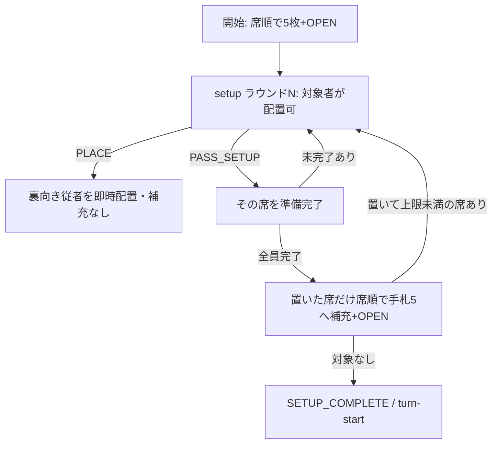

# 初期配置の同時化と反応窓の順不同合意 Implementation Plan

> **For agentic workers:** REQUIRED SUB-SKILL: Use superpowers:executing-plans to implement this plan task-by-task. Steps use checkbox (`- [ ]`) syntax for tracking. This document is a planning deliverable; it does not authorize production deploy by itself.

**Goal:** 卓上と同じく、初期従者配置は各自が順不同で行い、全員の準備完了で進む。第三者を含む公開反応窓では、カードを出す順番は席順のまま、「何もしない」の合意を順不同・まとめて出せるようにする。当事者（攻撃側・受ける側）だけが操作して攻撃が進み、割り込みたい人はいつでも割り込める状態を目指す。

**Architecture:** エンジンの受理規則を変え、同時に届く入力をサーバーが不要に `STALE_REVISION` で弾かないようにする。割り込みの実プレイは G03 の優先権を維持する。山札を引く補充はクリック順にせず、ラウンドごとに全員の準備完了後、席順で確定する。画面は「いま誰の番か」に加えて「誰が済んで誰が未回答か」を出す。

**Spec:** 本計画。根拠はデモ動画後の議論、原文 4.3・4.4（`resources/text/second-edition/MadoRule.txt` p.3）、[G03](../../rules/second-edition/rulings.md)（優先権と同時入力）、[G10](../../rules/second-edition/rulings.md)（初期配布とOPEN）、[G11 回収のオンライン補完](../../rules/second-edition/rulings.md)、[オンライン設計 §5・§6](../specs/2026-09-07-online-game-design.md)。

**Worktree / ブランチ:** 実装開始時に専用ブランチを切る。main への merge はユーザーが行う。

## 議論から採用すること / しないこと

採用する:

- 初期従者配置は席順待ちをやめる。各自が自分の手札を見て置き、全員が準備完了したら進む
- 原文の「配置後に5枚へ補充し、引いた従者も上限まで置ける」は、配置ラウンドを重ねて守る
- 公開の確認窓では、パスを順不同で受け付ける（パス先出し）
- 「この行動は任せる」を足す。押すと、その行動（攻撃1回など）が終わるまで公開窓で自動的にパス扱いになる。誰かがカード・能力・正体公開で状況を変えたら解除され、改めて聞かれる
- 停止中の席は公開窓の回答者から外す（原文 11.2: 停止中は手札も能力も使えない。停止は公開情報なので、外しても秘密は漏れない）
- 実カード・実能力の使用は、いま優先権のある人だけ受理する（クリック速度で結果を変えない）
- 介入があれば、先出しパスは捨てて起点から再開する（現行 G03 と同じ）
- 他人のパスが先に確定しても、優先権者の実プレイを `STALE_REVISION` / `STALE_WINDOW` で弾かない
- 正体公開は既に手番外・他人の優先権中でもできる。受理規則は変えない
- 配置中に手札と操作が同じ視野に入るよう、setup の画面を直す

入れない（後段）:

- 手札や能力の有無に応じた自動パス、手番・試合をまたぐ常時パス。秘密漏洩と切れ目の検証が別件。「任せる」は本人が行動ごとに明示し、手札によらず同じ動きをするので別物
- 時間切れでの自動パス（オンライン設計 §5 で不採用）
- 割り込みの予約（優先権前にカードを秘密で提出し、席順が来たら適用）。下の「後段」に設計だけ残す
- 出したパスの取り消し。一度出したパスは、介入で消えるまで有効（「任せる」の解除は、まだ開いていない窓に対してだけ効く）
- 割り込みカード自体の同時提出・到着順受理
- 踏み込み／間合いの当事者交互（G03 原文指定）の同時化
- 復活後の一人 `re-setup` の同時化（当人だけの再配置のまま。配置のたびの補充も現行どおり）
- 反応窓そのものを間引く（手札から回答者を減らすと正体・手札が読める）
- bot の初期配置ポリシー変更（現行 bot は `PASS_SETUP` を `PLACE` より先に選ぶので置かない。この挙動は維持する）

## 現状

初期配置（`packages/engine/src/transition.ts` の `transitionCore`）:

- `GameState.setupCursor` と `pending: { kind: 'initial-followers', actorId, seat }` で、一人ずつしか `PLACE_INITIAL_FOLLOWER` / `PASS_SETUP` できない。他人は `NOT_YOUR_TURN`
- `PLACE` のたびに `refillInitialHand` で手札5へ補充する。原文どおり引いた従者も置けるが、後の席は先の席の補充で山札が減った結果の後に引く
- `createGame` は席順に `refillInitialHand` → `advanceLifecycle` で初期5枚と OPEN を処理済み。setup 中の draw は入力待ちにならない
- `pending.actorId` は `view.ts` の setup `legalChoices`、`bot/policy.ts` の `actingActor`、`setup.test.ts` などが直接読む

反応窓:

- `ReactionWindow` は `participants` / `cursor` / `passed` / `revision`。優先権の判定 `participants[cursor]===actor` は `packages/engine/src` の24ファイルにある
- `PASS`（`combat/attack.ts`）は `cursor` 一致を要求し、`passed.push` → `cursor++` → `revision++`。`cursor===participants.length` で閉じる
- `resetParent` と命運凶変の取消は `passed=[]`、`cursor=0`、`revision++`。`REVEAL_CHARACTER` も `reclaim` 以外で `resetParent` を呼ぶ
- 全員対象（`participants(s)` 由来）の窓: `declaration`、`effect-level`、`damage`、`hit`、`attack-abilities`、`hit-abilities`、`follower-entry-abilities`、`reclaim`、判定窓（`before-roll` / `after-roll`、要確認）。`normal-defense` / `follower-start` / `defense-advance` などは一人だけの窓
- `reclaim` は `syncReclaimWindow`・受益者選択段階の `PASS`=辞退など独自の状態を持ち、G11 は「子の反応後も回答済みの席を復活させない」

通信（`apps/worker/src/rooms/room.ts`、`apps/web/src/connection/client.ts`）:

- ゲームコマンドは `current.revision !== expectedRevision` で `STALE_REVISION`、窓の `windowId` / `windowRevision` 不一致で `STALE_WINDOW`
- クライアントは `ack.revision === expectedRevision + 1` だけを成功と見なす
- そのため、今のまま同時入力を許すと、後から着いた側が毎回弾かれて押し直しになる。パスは `windowRevision` も上げるので、第三者の先出しパスで優先権者のカード使用が `STALE_WINDOW` になる

## 裁定の更新

### G10 — 初期配布とOPEN

現行「次に同じ席順で、各人の初期従者配置と再補充を完了させる」を次に替える。【原文】と【補完】を分けて書く。

【原文】（基本ルール 4.3・4.4、p.3）:

- 配られた手札に OPEN があれば、すぐ公開領域に出して5枚まで引く
- 手札に従者があれば、すぐ配置できる。配置できるのは2枚まで（祝福で+1）。左に置いた従者が最前線になる
- 配置後、手札を5枚に補充し直す。補充でさらに従者を引いたら、上限を超えない範囲ですぐ配置できる
- 一度配置した従者を手札に戻し、新しく引いた従者と入れ替えることはできない

【オンライン補完・この計画で採用】:

- 初期5枚配布と OPEN・その補充は、開始時に席順で全員分を終える（現行 `createGame` のまま）
- 初期従者配置はラウンド制で行う。ラウンド1の対象は全席
- ラウンド中、対象者は順不同で、ラウンド開始時の手札にある従者を配置上限まで置ける。置いた札は裏向きで即時配置になる
- 原文の「配置後の補充」は、置くたびではなくラウンド終了時にまとめて行う。山札の消費順をコミット順にしないための補完で、引く枚数と置ける従者は原文と同じになる
- 各対象者は置き終わったら `PASS_SETUP`（準備完了）。準備完了した席は、そのラウンドでは追加配置できない（ラウンドを閉じるための補完）
- 対象者全員が準備完了したら、そのラウンドで1枚以上置いた席だけ、席順で手札5への補充とその OPEN を処理する
- 次のラウンドの対象は「直前のラウンドで1枚以上置き、補充後も従者数が配置上限未満の席」。公開情報だけで決まるので、対象になったことから手札は読めない。対象者は従者を引いていなくても明示的に準備完了する
- 配置上限は補充中の OPEN（祝福）を処理した後の値で判定する。2枚置いた席も、補充で祝福を引けば次のラウンドの対象になる
- 置く位置（最前線か後ろか）は置くときに選べる。既存の従者より前にも置ける（下の「配置位置」）
- 対象が空になったら `SETUP_COMPLETE` し、開始席の `turn-start` へ進む。各ラウンドで誰かが1枚以上置かない限り次のラウンドはないので、有限回で終わる
- 初期セットアップが終わるまで勝敗評価はしない（現行どおりの補完）

配置位置: 原文では置く場所で前後が決まり、補充後に引いた従者を既存の従者の左（最前線）へ置くこともできる。現行エンジンの `PLACE_INITIAL_FOLLOWER` は位置を受け取らず、常に後ろへ追加する。ラウンド制にするとラウンド2の従者が必ず後ろになり、原文との差が目立つ。`PLACE_INITIAL_FOLLOWER` に任意の `position: 'front' | 'back'`（省略時 `back`）を足し、`re-setup` でも同じにする。配置済みの従者どうしの並べ替えは、原文 8 の行動「従者の配置」でだけ認める（setup では認めない）。

これで共有山札の消費順は「ラウンド内は席順」で再現でき、操作は卓上の「各自置いて、補充して、引いた分を置いて揃ったら始める」になる。

却下した案: 置くたびに本人だけ即時補充する案。原文に最も近いが、山札の消費順がコミット順で決まり、他席の OPEN を見てから置く時期を選べる。

### G03 — 優先権と同時入力

原文に優先権・席順の規定はない。原文は「いつでも」カードを「手番と関係なく使用できる」（p.3）、正体公開を「いつでも行なうことができる」（11.4）とだけ書く。G03 の優先権は、原文の到着順をオンラインで公平にするための既存の補完で、パス先出しもその補完の変更として扱う。原文の規定があるのは、当事者が交互に出す踏み込み・間合い（6.1・6.2.3・6.3）だけで、これは変えない。

現行「受理順をクリック速度で決めず、優先権を持つ人の合法入力だけ受ける。全対象者が同じ窓世代で続けてパスすると閉じる。」を次に替える。

- 受理順をクリック速度で決めない。状態を変える介入（カード使用・能力使用・取消など）は、優先権を持つ人の合法入力だけ受ける
- 優先権は「その窓世代でまだパスしていない対象者のうち、起点から見て最先の席」にある
- パス先出し対象の窓では、`PASS` はその窓世代の対象者なら優先権前でも受理する。同じ世代への二重パスは拒否する。取り消しはできない
- 全対象者が同じ窓世代でパスすると閉じる
- 状態を変える介入または正体公開があればパス記録を消し、親の起点から再開する（現行どおり）。先出しパスも消える

「この行動は任せる」（行動単位のパス）:

- 対象は、パス先出し対象の窓に回答する権利のある席すべて（攻撃側・受ける側も使える。受ける側の通常防御など一人の窓には効かない）
- 範囲は、いま開いている窓の根の行動（手番の攻撃1回、手番カード1枚、いつでもカード1枚など）が終わるまで。その行動の公開窓が開くたび、エンジンが即座にその席のパスを記録する。判定の出目が出たあとの窓にも効く
- 解除: その行動の中で、誰かのパス以外の入力（カード使用・防御・能力・取消・正体公開）が受理されたら、全員の「任せる」を消す（§5「元のパスを新しい状況に流用しない」）。本人はいつでも解除できるが、既に記録されたパスは戻らない
- 出目を見てから判断したい人（神性介入・命運凶変を持つ人など）は「任せる」を使わず、窓ごとにパスする。これは卓上で「ちょっと待って」と言うのと同じ読まれ方をする。許容する
- 「任せる」は公開する（卓上の「どうぞ」と同じ）。戦記には行動ごとに1行「Cはこの行動を任せました」と記録し、自動で入ったパスは個別に記録しない（戦記の量も減る）

停止中の席:

- 公開窓を開くとき、停止中の席を回答者から外す。窓が開いている間に停止が解けた・付いた場合は次の窓から反映する
- 先に、停止中の席が公開窓で `PASS` と正体公開以外の合法手を持たないことをコードと試験で確認する。例外があれば、その窓だけ外さない

期待する効果（4人卓、攻撃1回で公開窓が約14回開く場合）: 現行は全員が席順に約14回ずつパス（計約56回）。変更後は、第三者は「任せる」1回（受ける側が防御札を出すたびに聞き直し1回）、当事者も自分の判断がある窓だけ操作する。

パス先出し対象の窓（許可リスト。対象者が2人以上のときだけ）:

- `declaration`、`before-roll`、`after-roll`、`effect-level`、`damage`、`hit`、`attack-abilities`、`hit-abilities`、`follower-entry-abilities`
- `reclaim` は G11 の規則が別なので、別タスク（Task 9）で G11 に追記してから入れる

対象外（現行どおり優先権者だけがパスできる）:

- 当事者交互: `approach` / `withdrawal` / `defense-advance`
- 一人の窓: `normal-defense`、`follower-start`、`wish`、`wish-capacity`、`private-inspection`、`beast-capture`、`shadow-jump-cost`、`ability-attack`、`technique-double-choice`、`lifetime-effect-choice`、`on-hit-choice`、`follower-bypass-choice`、`re-setup`、`revival`
- 死亡・復活系の全員窓: `death-gift`、`lifecycle-boundary`（死亡予定者を含む特殊な対象集合のため後段）

### オンライン設計 §5・§6

- §5 の3「順番で優先権を渡す」に「パスだけは対象者が先に出せる。実介入の順番は変えない」を足す
- §5 の漏れの注意に「先出しパスの有無と時刻は公開される。卓上で『パス』と先に言うのと同じ扱いとし、自動パスとは区別する」を足す
- §6 に「窓世代と setup ラウンドが同じなら、他席のパス・配置による revision 差は受理する」を足す（下の「通信」）

## 状態と投影

ゲーム状態（エンジン）:

- `setupCursor` を廃止する
- `pending` は `{ kind: 'initial-followers'; round: number; participantIds: PlayerId[]; readyIds: PlayerId[]; placedIds: PlayerId[] }` にする
- 最後の `PASS_SETUP` を受けた遷移の中で、`createGame` と同じ形（席順に `refillInitialHand` → `advanceLifecycle`）で補充と OPEN を済ませ、次ラウンドの対象を計算する。配置上限は OPEN（祝福など）処理後の `gameStats(...).followerLimit` で判定する
- `standingPasses?: { rootEventId: string; actorIds: PlayerId[] }` を足す。根の行動が変わる・終わる、または介入が受理されたら消す
- 窓を開いた直後に、`standingPasses` の席と停止中の席を処理する。全員がパス扱いなら、同じ遷移の中で窓を閉じて次へ進む
- 反応窓の `passed` / `cursor` は残す。`cursor` は常に「未パスの最先の対象者」を指す。パス受理のたびに再計算し、`passed.length===participants.length` で閉じる（`cursor++` 前提をやめる）
- `ReactionWindow.revision` は「窓世代」とし、パスでは上げない。介入・取消・公開・起点変更でだけ上げる。`passed` を読む箇所（`reclaim.ts`、`abilities/distance.ts` など）はパス順に依存していないか確認する

`PlayerView`:

- `pending` を `{ kind, round, participantIds, readyIds }` にする（配置枚数は既存の裏向き従者で見える）
- setup 中は、対象者かつ未完了なら `PLACE_INITIAL_FOLLOWER` と `PASS_SETUP` を出す。完了席・対象外には出さない
- `activeWindow.passedActorIds: PlayerId[]` と `activeWindow.passAhead: boolean` を公開する
- `standingPassActorIds: PlayerId[]` を公開する。`legalChoices` に `PASS_ACTION_THROUGH`（任せる）と `CANCEL_PASS_THROUGH`（解除）を出す
- パス先出し対象の窓では、対象者かつ未パスなら、優先権がなくても `legalChoices` に `PASS` を含める
- `PLAY_*`・能力・その他の選択肢は従来どおり `hasPriority` のときだけ

## 通信

同時入力を正常系にするため、revision 差を次のとおり扱う。

- エンジンに `commandBaseRef(state)` を置く（`activeWindowRef` を拡張してよい）。窓があれば `{ windowId, windowRevision }`（窓世代）、setup 中は `{ windowId: 'setup-<round>', windowRevision: 0 }`、それ以外は `null`
- `view.activeWindow` とは別に、クライアントが送る基準をこの値から作る。protocol の `windowId` / `windowRevision` の形は変えない
- worker は、`expectedRevision < current.revision` でも、送られた基準が現在の `commandBaseRef` と一致するゲームコマンドは `transition` に渡す。不一致なら従来どおり `STALE_WINDOW` / `STALE_REVISION`。受理可否の最終判断はエンジンの合法性検査
- 基準が `null` の場面（通常の手番操作・ロビー）は従来どおり revision 完全一致
- クライアントの ack 判定を `ack.revision > expectedRevision` に緩める
- `STALE_WINDOW` の文言を「状況が変わりました。もう一度判断してください」にする（他人の介入でパスが無効になった場合に出る）

これで、D の先出しパスの直後に届いた B のカード使用は受理され、B のカード使用の直後に届いた D の古いパスは `STALE_WINDOW` になる。

実装で確定した細部（PR A）:

- 基準はワイヤ上で任意にする。基準を名乗ったコマンドは現在の基準と一致することを要求し、一致すれば revision 差を受理する。反応窓が開いている場面では従来どおり基準を名乗ることを必須にする。setup 中に基準を必須にすると、revision 完全一致で送る既存の経路まで拒否してしまうため
- `RoomStorage.commit` に任意の `baseRevision` を足し、revision 差を受理したコマンドは現在の revision を基準に直列化する。受領証の指紋はクライアントの `expectedRevision` のままなので、同じ封筒の再送は従来どおり冪等

実装で確定した細部（PR B）:

- `PASS` はどの窓でも窓世代を上げない（対象外の窓も含む）。窓世代を上げるのは介入・取消・公開・起点変更だけで、`cursor` は常に `syncPriority` で「未パスの最先」に再計算する
- 停止中の席を公開窓から外す例外は `reclaim` だけにした。通常回収は持ち札の権利で、停止（原文 11.2 の「手札も能力も使えない」）では失われないため（G11）。他の許可リストの窓では、対象者が2人以上のときだけ外す
- 「任せる」の範囲を決める根の行動は、窓の `eventId` ではなく continuation からたどる。`follower-entry-abilities` などは `<group>-<seat>-follower-entry` という合成 `eventId` を持ち、親の窓も残っていないので、`eventId` からたどると行動が変わったと誤判定して解除されてしまう
- 窓が1つも残らない遷移の終わりで `standingPasses` を消す。行動が終わった後に席の一覧が残らない
- 戦記の「任せる」は `PASSED` イベントの `windowKind: 'action-through'` で表す。回収窓で押した場合だけは、回収回答を記録しない既存の規則（G11）を優先して記録しない
- 画面は各パネルへ配るのではなく、公開窓の回答状況（優先権者・未回答・パス済み・任せている席）とパスの操作をまとめた `WindowStatus` を1つ置き、`ReactionPanel`・`AbilityPanel`・`ReclaimPanel` のどれが窓を持っていても同じ表示にした。`ReactionPanel` は実プレイ権のある席にだけ話しかける

## 画面

初期配置:

- 参加者欄に「配置中 / 準備完了 / 対象外」とラウンド番号を出す
- `phase==='setup'` のとき、自分の手札と「従者を置く / 配置を終える」を同じ視野に置く（手札をコマンドバー直上へ移すか sticky にする）
- ラウンド2以降の自分向け文言は「補充で引いた従者があれば置けます」
- 待ち帯は「全員の準備完了を待っています（未完了: …）」
- 準備完了の操作名は「従者を置かず進む」から「配置を終える」にする（置いてから押す場合があるため）

反応窓:

- 優先権者: 「あなたの判断です」（実プレイ可）
- 対象者で未パス: 「先にパスできます。カードを出す番はまだです（いま: ◯さん）」とパスボタン
- パスボタンは2つ: 「パス（この確認だけ）」と「この行動は任せる」。後者には「出目や防御を見てから割り込むことはできなくなります。誰かが動いたら聞き直します」と添える
- 任せている間: 「この行動は任せています（解除）」を出す。参加者欄にも「任せる」の印
- 対象者でパス済み: 「パス済み。未回答: …」
- 第三者・対象外: 優先権者、未回答、パス済みの名前
- 他人のパスで `windowRevision` が変わらなくなるので、`Board.tsx` の `ReactionPanel` の `key` で入力中の選択が消えないことを確認する

## 作業単位

各タスクは失敗する試験を先に書き、エンジン → 投影 → 通信 → UI の順で通す。タスクごとにコミットする（コミットは実装工程のあとの工程で作るので、チェック項目にしない）。

PR を2本に分ける。B は A の「同時入力の通信」（Task 4）に依存するので、A のマージ後に始める。

- **PR A — 初期配置の同時化と同時入力の通信（完了。main の 5b61a019）:** Task 1A、2、3、4、5、10A
- **PR B — 反応窓の順不同合意:** Task 1B、6、7、7b、8、9、10B

前提: [捨て札の非公開化と戦記](2026-09-16-public-record.md) は main にマージ済み（PR #6）。パスは `public-record.ts` の `recordPass` で戦記に記録されている。窓のパス処理を変えるときは、この記録と `public-record-privacy.test.ts` を保つ。

### Task 1A: 裁定と設計文書（初期配置・通信）

- [x] `docs/rules/second-edition/rulings.md` の G10 を上記に替える。【原文】と【オンライン補完】を分けて書く
- [x] `docs/rules/analysis.md` の R12 に「配置はラウンド内同時、補充はラウンド後に席順」と採用日を追記する
- [x] `docs/superpowers/specs/2026-09-07-online-game-design.md` の §6 を上記に更新する
- コミット: `docs: define concurrent setup rounds`

### Task 1B: 裁定と設計文書（反応窓）

- [x] `docs/rules/second-edition/rulings.md` の G03 を上記に替える（パス先出し、「任せる」、停止中の席）
- [x] `docs/superpowers/specs/2026-09-07-online-game-design.md` の §5 を上記に更新する
- コミット: `docs: define pass-ahead and passing through an action`

### Task 2: 初期配置の試験を先に書く

- [x] `packages/engine/test/setup.test.ts` / `followers.test.ts` に追加・書き換え
  - B が A の準備完了前に `PLACE_INITIAL_FOLLOWER` できる
  - A が2枚置くあいだ `hand.length` は 4, 3 で、補充は起きない
  - 全員 `PASS_SETUP` 後、置いた席だけ席順で手札が5に戻る。置かなかった席の手札と山札消費は変わらない
  - 同じ entropy なら、置く順番（A→B と B→A）を入れ替えても補充後の手札・山札が一致する
  - ラウンド1で1枚置いた席がラウンド2の対象になり、補充で引いた従者を置ける。2枚置いた席・置かなかった席は対象外
  - ラウンド2の対象が全員準備完了すると `SETUP_COMPLETE` と `turn-start`
  - 準備完了済み・対象外の `PLACE` / `PASS_SETUP` は `NOT_YOUR_TURN` で状態不変
  - 初期 OPEN の祝福で上限が上がった席の扱い（上限は OPEN 処理後で判定）。ラウンド1で2枚置き、補充で祝福を引いた席がラウンド2の対象になる
  - `position: 'front'` で置くと既存の従者より前、省略時は後ろ。ラウンド2で引いた従者を最前線に置ける
  - `re-setup` でも `position` が効く
  - 城の陣営制限・非従者拒否・`re-setup` の一人配置と即時補充は現状維持
- コミット: `test: expect concurrent initial follower rounds`

### Task 3: 初期配置のエンジン

- [x] `state.ts`: `setupCursor` を削除し、`pending` を新しい形にする
- [x] `packages/protocol` の `PLACE_INITIAL_FOLLOWER` に任意の `position` を足し、検証試験を追加する
- [x] `setup.ts` の `createGame`: `pending` を `{ round: 1, participantIds: seatOrder, readyIds: [], placedIds: [] }` にする
- [x] `transitionCore` の setup 分岐を新規則にする。補充とラウンド遷移は最後の `PASS_SETUP` の中で行う
- [x] `view.ts`: setup の `legalChoices` と `pending` 投影を変える
- [x] `bot/policy.ts` の `actingActor`: `pending.actorId` の代わりに「未完了の対象者の最先」を使う
- [x] `abilities/conditional-selection.ts` は `s.pending` の有無だけを見るので変更不要なことを確認する
- [x] 試験の移行: `PLACE_INITIAL_FOLLOWER` を使う試験は engine 約50本、worker 約130本（`apps/worker/test/fixtures` を含む）ある
  - まず `packages/engine/test/fixtures.ts` と worker fixture に「席ごとの配置指定を受けてラウンドを最後まで進める」ヘルパを作り、各試験をそれに寄せる
  - 置いた直後の補充に依存していた期待値（手札・山札・OPEN の出る席）は、ラウンド後補充の結果で書き直す。期待値を変えた試験は理由をコミットに書く
  - `s.pending!.actorId` を使う試験はヘルパに置き換える
- [x] `bot-full-game.test.ts` が通ることを確認する
- コミット: `feat: accept initial follower placement in concurrent rounds`

### Task 4: 同時入力の通信

- [x] エンジンに `commandBaseRef` を追加し、`index.ts` から出す。単体試験（窓あり・setup・それ以外）
- [x] `room.ts`: 基準一致なら revision 差を受理する。`apps/worker/test/room-websocket.test.ts` に追加
  - setup で A と B が同じ revision を基準に `PLACE` を送り、両方 ack される
  - setup ラウンドが進んだ後の古い基準は `STALE_WINDOW`
  - 基準が `null` の手番操作は従来どおり `STALE_REVISION`
- [x] `client.ts`: 送信基準を `commandBaseRef` 相当の投影から作り、ack 判定を `>` にする。`apps/web/test/connection.test.ts` に追加
- [x] `scripts/load_test.ts` の `STALE_REVISION` 再送が不要になった箇所を確認する（残してもよい）
- コミット: `feat: accept concurrent commands on the same window generation`

### Task 5: setup 画面

- [x] 参加者カードに準備状態とラウンドを出す
- [x] setup 中は手札をコマンドバー直上へ移すか sticky にし、選んで置ける
- [x] 既に従者がいるとき「前に置く / 後ろに置く」を選べる（`re-setup` の `LifecyclePanel` も同じ）
- [x] 待ち文言とラウンド2以降の文言
- [x] `apps/web/test` に setup 投影の文言試験を足す
- コミット: `feat: show concurrent setup status and own hand`

### Task 6: パス先出しの試験を先に書く

- [x] 宣言窓（起点 A、順 A→B→C→D）で A がパスし優先権が B のあいだに、D が `PASS` でき、窓は閉じず優先権は B のまま
- [x] B, C がパスすると、D を飛ばして窓が閉じる
- [x] C が先出し、B がパスすると優先権は D へ進む（パス済みの C を飛ばす）
- [x] D の二重パスは拒否、状態不変
- [x] 先出しパスでは `windows.at(-1).revision` が変わらない
- [x] B が命運凶変を出したあと、D の先出しパスは消え、D は再回答する（S01 と同じ）
- [x] 他人の優先権中に C が正体公開すると、先出しパスも消える
- [x] 優先権のない D の `PLAY_REACTION` は従来どおり `NOT_PRIORITY`
- [x] `approach` の非手番 `PASS`、`wish` 中の他人 `PASS`、`normal-defense` の他人 `PASS` は従来どおり拒否
- [x] `death-gift` / `lifecycle-boundary` では先出しできない
- [x] `view.test.ts`: 対象窓で優先権のない対象者の `legalChoices` が `['PASS']`（と正体公開）だけ、パス済みなら `PASS` なし。`passedActorIds` の投影
- コミット: `test: expect out-of-order PASS on public windows`

### Task 7: パス先出しのエンジン

- [x] 許可リストと「未パスの最先」を計算する関数を `reactions/windows.ts` に置く
- [x] `combat/attack.ts` の `PASS`: 対象窓かつ対象者かつ未パスなら `cursor` 不一致でも受理。`passed` に加え `cursor` を再計算し、全員パスで `closeWindow`。パスでは `revision` を上げない
- [x] `resetParent`・命運凶変取消・公開は現行どおり `passed=[]`、`cursor=0`、`revision++`
- [x] `cursor` を直接進める他の箇所（`syncReclaimWindow`、`abilities/distance.ts` など）がパス済み席を飛ばす前提を壊さないか確認する
- [x] `view.ts`: `legalChoices`・`passedActorIds`・`passAhead`
- [x] 既存の `while (...) pass()` 型の試験は、優先権者パスのままで通ることを確認する
- [x] `scenario-s01-s05.test.ts`（同時介入の席順）が変更なしで通ることを確認する
- コミット: `feat: accept PASS before priority on public windows`

### Task 7b: 「この行動は任せる」と停止中の席

- [x] protocol に `PASS_ACTION_THROUGH` / `CANCEL_PASS_THROUGH` を足し、検証試験を書く
- [x] 試験（先に書く）
  - C と D が宣言窓で「任せる」→ 以後の判定前・判定後・効果Lv・ダメージ・命中の窓で C と D のパスが自動で入り、A と B の回答だけで進む
  - 全員が「任せる」なら、受ける側の通常防御など一人の窓まで1回の遷移で進む
  - B が防御札を出すと全員の「任せる」が消え、その宣言窓で C と D に聞き直す
  - 正体公開・命運凶変でも消える。行動が終わると消え、次の攻撃には持ち越さない
  - 解除後に開いた窓では聞かれる。解除前に入ったパスは戻らない
  - 「任せる」中でも、本人が優先権を持つ窓が開く前に解除すればカードを使える
  - 停止中の席は公開窓の回答者に入らない。停止中の席が公開窓で持つ合法手が `PASS` と正体公開だけであることを全窓種で確認する
  - 戦記: 「任せる」は行動ごとに1件、自動で入ったパスは記録しない。秘密漏れ試験（`public-record-privacy.test.ts`）が通る
- [x] エンジン: `standingPasses`、窓を開いた直後の処理、解除条件、根の行動の求め方（窓の continuation から行動をたどる）
- [x] bot: 合法手に「任せる」があっても使わない（既存の全試合試験の手順を変えない）
- コミット: `feat: let seats pass through a whole action and skip stopped seats`

### Task 8: 反応窓の画面

- [x] `ReactionPanel` と、全員対象の窓を出す `AbilityPanel` などに、優先権者・未回答・パス済みを出す
- [x] 優先権がない対象者にもパスボタンを出す。実プレイの入力は出さない
- [x] 「この行動は任せる」と解除、参加者欄の印、戦記の文言
- [x] 「あなたの判断です」は実プレイ権があるときだけにする
- [x] 他人のパスで入力中の選択が消えないことを web 試験で確認する
- コミット: `feat: show who passed and allow pass-ahead in the decision panel`

### Task 9: 回収窓のパス先出し

原文の回収は「持ち技は一度使用した後」「持ち従者は一度死亡した後」に、その人物が一回だけ手札に戻せる（p.2）というだけで、回答の順番はない。全員に回答を回すのは、回収権の有無を隠すための G11 の補完で、物理札を使うたびに全員の回答待ちが起きる。待ち時間の効果が大きいが、G11 の規則が別なので分ける。

- [x] G11 に追記: 回収回答でも「回収しない」パスは先出しできる。回収の成立は現在の回収回答席だけ。子の反応後も回答済みの席は復活させない（現行 G11）ので、先出しパスも残る。受益者選択段階の `PASS`（辞退）は先出し対象外
- [x] 試験: 先出しパス、成立で競合終了、子反応後に先出しパスが残る、受益者選択段階の他人 `PASS` 拒否、`ReclaimPanel` の表示
- [x] `reclaim` を許可リストへ入れ、`syncReclaimWindow` を合わせる
- コミット: `feat: allow pass-ahead on reclaim responses`

### Task 10A: 通し確認（初期配置・通信）

- [x] `pnpm test` と `pnpm typecheck`
- [x] 4人の初期配置（Playwright、別ブラウザ文脈）: 後席が先に置いて準備完了し、先席が後から置いても本編に入れる。1枚置いた席がラウンド2で引いた従者を置ける

### Task 10B: 通し確認（反応窓）

- [x] `pnpm test` と `pnpm typecheck`
- [x] 攻撃1回: 後席が先にパスし、ほぼ同時に優先権者がカードを出しても押し直しにならない。カードが出たら先出しパスが消えて再回答になる
- [x] 攻撃1回: 第三者2人が「任せる」を押すと、攻撃側と受ける側の操作だけで命中まで進む。受ける側が防御札を出すと第三者に聞き直しが出る
- [x] 正体公開は他人の優先権中でもできる（`combat.spec` は既に無い。`reconnect.spec` の「他人の優先権を保ったまま再読込」と engine 側の公開試験で確認した）

## 受け入れ条件

- 初期配置で先の席の操作を待つ必要がない
- 原文どおり、配置後の補充で引いた従者を上限まで置け、最前線にも置ける
- 裁定文書で、原文の規定とオンライン補完が区別されている
- 配置中に本人の手札が見え、選んで置ける
- 補充順はラウンド内で席順。同じ entropy なら配置の到着順によらず同じ結果
- 公開反応窓で、パスのために席順一周を待つ必要がない
- 第三者は攻撃1回につき「任せる」1回（と、状況が変わったときの聞き直し）で済む
- 割り込みたい人は、窓ごとのパスを選べば全ての境界で判断できる。「任せる」を押していない限り、機会が勝手に流れることはない
- 命運凶変など実介入の受理順は席順のまま
- 他人のパスや配置と同時に送った操作が、それだけの理由で弾かれない
- 正体公開のタイミングは現状維持

## 後段（設計メモ）

- **割り込みの予約:** 優先権が来る前に、カード使用を秘密でサーバーへ預ける。他者には「回答済み」とだけ見せ、席順で自分の番が来た時点で合法なら適用する。先の席が介入して窓が作り直されたら破棄して聞き直す。受理順は席順のままなので公平さは変わらず、窓の所要時間が「全員の考慮時間の合計」から「最大」になる。さらに、パスを先に出さない席＝何か持っている、という読まれ方も消える。介入は全回答の数%なので効果は限定的で、秘密の保持と二重検証が要る。パス先出しと「任せる」を使ってみてから判断する
- **手番単位の「任せる」:** 「この手番が終わるまで任せる」。便利だが、取り逃しの後悔が増えるので使用感を見てから

## リスク

- 「任せる」で取り逃す: 出目を見てから割り込みたかった、という後悔が起こり得る。ボタンの説明文で明示し、状況が変わるたびに解除して聞き直すことで減らす。窓ごとのパスを既定の並び順で先に置く
- 「任せる」を使わない席は「何か持っている」と読まれる。卓上の「ちょっと待って」と同じで、はったりにも使える。気になる場合は後段の「割り込みの予約」で消せる
- 全員が「任せる」だと多数の窓が1回の遷移で閉じる。画面では何が起きたか追いにくいので、戦記と判定表示で結果を確認できるようにする

- 置いた席はラウンド2の準備完了を押す手間が増える。対象を手札で絞ると従者を引いたことが読めるので、絞らない
- 補充と OPEN がラウンド後にまとめて出るので、配置を終えてから本編開始までに一段の待ちが入る
- revision 差を受理する範囲を誤ると、古い画面に基づく操作が通る。基準は窓世代と setup ラウンドだけに限り、エンジンの合法性検査を必ず通す
- パスで窓世代を上げなくなるので、窓世代で「パス後の再描画」をしていた UI・試験が変わる
- 先出しパスの有無と時刻は公開され、「今の状況には反応しない」と読める。卓上で先にパスと言うのと同じ扱いにする。介入があれば消えるので、後から反応する機会は失わない
- 正体公開でも先出しパスが消えるので、公開が多い卓では再回答が増える
- 試験の移行量が大きい（配置を使う試験は約180本）。ヘルパへ寄せてから期待値を直し、変えた期待値は理由を残す
