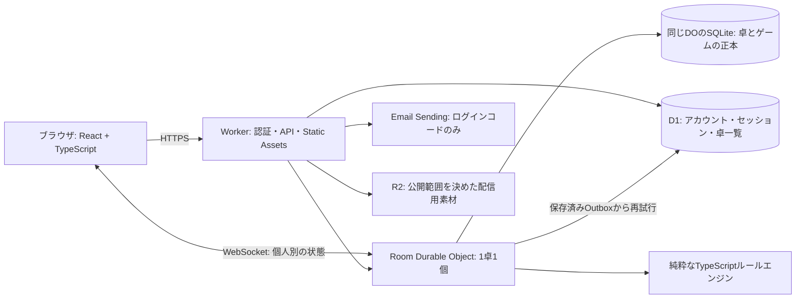

# 魔導戦記オンライン 設計案

作成: 2026-09-07。状態: 資料調査に基づく提案。2nd採用はユーザー決定済み。全カード仕様案と補完裁定案を追加済み。補完裁定は2026-09-08にユーザーが試作の基準として暫定採用。実装中の範囲と検証結果は[進捗](../../implementation-progress.md)を参照。

## 1. 目標と最初の提供範囲

ブラウザで卓を作り、募集卓への参加または招待リンクから着席して、魔導戦記を複数人で遊べるようにする。参加者が意識すべきなのはゲームの判断であり、山札の枚数管理・判定の計算・公開範囲・進行の整合性はサーバーが担う。

初回の完成版は、1つの版を対象に、4-10人の同期対戦、卓一覧、招待限定卓、着席・準備完了・開始、非公開の配役と手札、ルールによる進行、切断復帰、終了結果までを扱う。4-10人は採用した2ndの仕様に基づく。

小規模な友人同士のテストから開始する。当初は匿名ゲストセッションと表示名で始めたが、2026-09-15の[アカウント計画](../plans/2026-09-15-account-auth.md)でゲストを廃止し、メールアドレスで登録したアカウントだけが着席できるようにした。ログインはメールの6桁コードとパスキー、Cookieは30日で10日ごとに延長する。送るメールはログインコードだけで、手番メールによる非同期対戦は対象外。フレンド、ランキング、レーティング、観戦、チャット、音声通話、通知、日をまたぐ非同期対戦は後段へ分ける。招待リンクは作成して画面に出し、ユーザー自身が共有する。

画面はデスクトップ・タブレットのブラウザを優先。スマートフォンはルールを読める拡大表示と操作パネルを重視し、盤面を単純縮小して10人分のカードを詰め込まない。

## 2. 方式の比較

| 方式 | 利点 | 課題 | 判断 |
|---|---|---|---|
| サーバー判定型の専用ゲーム | 秘密情報・割り込み順・計算が統一され、再接続可能 | ルール転記と例外裁定の初期負担が大きい | 最終形として推奨 |
| 手動操作中心の仮想卓 | 既存画像を早く使え、未知の裁定を人が補える | 毎回ルールに詳しい人が必要、BGA的な進行支援は弱い | 調査用の補助ツールとしてのみ候補 |
| ホストのブラウザ / P2Pで判定 | 中央サーバー処理を減らせる | ホスト切断、秘密情報、競合、復旧が難しい | 採用しない |

推奨は、専用ゲーム方式の基盤を最初に作り、検証済みカードを少しずつ増やす進め方。少数カードの試作を「全ルール対応版」として公開しない。裁定不能な組み合わせを本番中にホストの任意書き換えで解決する機能は、最初の完成版に含めない。

## 3. Cloudflareの構成



フロントとHTTP APIはWorkers、画面の静的ファイルはWorkers Static Assetsを使う。専用の常駐Nodeサーバーやコンテナは不要。[Static Assets公式資料](https://developers.cloudflare.com/workers/static-assets/)

DOは卓ごとの調停と保存を担当し、ゲーム状態をSQLiteへ永続化する。D1はセッションや卓の検索用インデックスであり、試合中の手札・ダメージ・優先権の正本にはしない。[DOストレージ公式資料](https://developers.cloudflare.com/durable-objects/best-practices/access-durable-objects-storage/)

R2は画像の配信・保管に使う候補。初期の少数カード検証ではローカルの検証素材でよく、原本ZIPや全PDFをアプリの配信ディレクトリへコピーしない。実装前に素材の利用条件と配信範囲を確認する。[R2公式概要](https://developers.cloudflare.com/r2/)

### 常時接続について

**常時CPUを動かすことと、対戦中の接続を維持することは別。**

- 対戦中はWebSocketを張り、操作・反応要求・結果を通知する。
- `acceptWebSocket()` のHibernation方式を使い、操作待ちの間はDOを休止可能にする。
- 全員のブラウザが閉じても、ゲーム状態と回答待ちはストレージに残す。
- 復帰時は認証し直し、本人向けに投影した現在のスナップショットを送る。
- クライアントのアニメーションや毎秒のカウント表示のためにサーバーを毎秒起こさない。

Hibernationでメモリ上の状態が失われ、再開時にコンストラクターが走る点を前提にする。WebSocket attachmentには参加者IDと接続世代等の最小情報のみを置き、接続をまたいで必要な情報は保存する。[WebSocket Hibernation公式資料](https://developers.cloudflare.com/durable-objects/best-practices/websockets/)

### 期限と切断

最初は「時間制限なし、明示的なパス」を標準とする。切断は敗北・パスと見なさず、その人が答えるべきところで待つ。卓主が切断しても他の人が回答可能な処理は継続する。募集時に卓主が抜けた場合は、残る最古の席へ卓管理者を移す。試合中の管理権にルール上の特権は付けない。

回答期限付きモードは、検証後の追加機能とする。その場合は締切を絶対時刻で保存し、DO Alarmで起こす。1 DOのAlarmは1つなので、複数の期限やOutbox再送を保存し最も近い時刻を予約する。Alarmは再試行され得るため、期限処理も冪等にする。[Alarms公式資料](https://developers.cloudflare.com/durable-objects/api/alarms/)

長期放置卓の削除は、無断で進行中の試合を失わない保存方針を決めてから実装する。初期テストでは進行中の卓を自動削除しない。全員の合意による中断終了を提供する。

## 4. ゲームエンジンの境界

`packages/engine` はCloudflare、HTTP、DOMから独立させる。入力は状態・認証済み行為者・コマンド・確定した乱数や時刻、出力は次状態・保存用イベント・入力待ち要求。画面側にゲームの正否を決めさせない。

保存する主な情報:

| 情報 | 具体的な内容 |
|---|---|
| 版 | `rulesetId`, `rulesetVersion`, `cardCatalogVersion`, `schemaVersion` |
| 進行 | 手番、フェイズ、席順、試合状態、単調増加の`revision` |
| 参加者 | キャラクター、元/現在陣営、公開済みか、ダメージ、停止・異界・死亡・流浪 |
| カード | 定義IDと物理的なインスタンスID、山札順、手札、従者前後、詠唱、強化、捨て札 |
| 関係 | プレイヤー間の距離、保護対象、陣営変更の原因 |
| 解決途中 | 現在の攻撃グループ、対象、ヒット、宣言済み効果値、従者受け開始フラグ |
| 反応待ち | `windowId`, `windowRevision`, 優先権、パス済み集合、再開先 |
| 再現性 | 乱数結果、回収済みの持ち技、解決済み誘発効果ID、処理済みcommandId |

中断位置をPromise・関数・タイマーのクロージャとして持たず、JSON化できる継続フレームとして保存する。例えば `resolveHit(targetId, hitIndex, step)` の引数を記録し、割り込みとその補充を終えたらその位置へ戻る。反撃で元の攻撃が消えた場合は無効になった継続を破棄する。

カードは「条件」「使用タイミング」「対象」「消費」「効果」「終了条件」「任意/強制」「情報公開」の項目で構造化する。最初から任意スクリプト実行や巨大な汎用DSLを作らず、型付きの効果と少数の専用ハンドラーを組み合わせる。特殊能力は必ず任意使用か強制制限かを分ける。

## 5. 反応受付のオンライン案

詳細は[2nd共通裁定G03–G18](../../rules/second-edition/rulings.md)に固定案を記載した。以下は概要であり、原作の既定ルールではない。

1. 基本処理を、宣言・判定・従者受けなど意味のある境界で止める。
2. `windowId` と対象処理IDを発行し、現在誰の回答を待っているかを通知する。
3. 当事者間の踏み込み・間合いは明示的に交互回答する。第三者介入の窓では、起点と席順が公開された順番で優先権を渡す。
4. 能力・手札による行動候補は本人だけに送る。何もしない場合はパスを明示する。
5. 介入があれば子処理を解決し、影響を受ける候補を再計算し、窓の世代を更新する。元のパスを新しい状況に流用しない。
6. 必要な全員が同じ状況に対してパスしたら確定し、次の境界まで進める。

「早くクリックした人を勝ちにする」「3秒以内に押さないと自動失敗」を標準にしない。通信の遅いプレイヤーにも判断の機会を与える。

秘密情報から反応可能な人だけを選んで全員に待ち表示すると、手札や正体が推測できてしまう。初期版では公開情報から決めた対象集合を巡回し、本人だけが候補を見られるようにする。自動パスを追加する場合は、本人が設定した範囲のみで、他者には設定や不可能理由を送らない。無反応時の表示時間からの漏れも検証する。

2Eの確定事項として、従者受け後にその防御側が通常防御へ戻ることは拒否する。正体公開自体を禁じることとは区別し、公開による攻撃回避は境界後には認めない。第三者の「いつでも」まで一律禁止できるかは別途裁定する。

## 6. コマンドの受付と復旧

クライアントからは、例えば次のような「意思」を受け取る。行為者IDはセッションから決め、JSON内の自己申告を信じない。

```json
{
  "protocolVersion": 1,
  "commandId": "client-generated-unique-id",
  "expectedRevision": 42,
  "windowId": "defense-12",
  "windowRevision": 3,
  "type": "PASS"
}
```

サーバー処理の順:

1. メッセージ形、サイズ上限、セッション、席、接続世代を検証する。
2. 処理済みcommandIdなら元の結果を返す。同じIDで別内容なら拒否する。
3. revisionと反応窓の世代を検証し、古い画面からの操作なら再同期を求める。
4. 優先権・カード所有・タイミング・対象・コストを検証する。
5. ルールを進め、状態・イベント・処理済みコマンド・Outboxを同じローカルトランザクションで保存する。
6. 永続化の完了後にACKと個人別スナップショットを送る。D1の卓一覧反映は再送可能な別処理で行う。

DOが1卓の調停役でも、`await`をまたぐ処理が自動的にアプリ全体の競合を防ぐとは考えない。ゲームの検証とローカル保存の区間に外部HTTP/D1呼び出しを挟まない。復元時の初期化を同期させ、1コマンドの確定区間を直列化する。外部反映はOutboxから冪等更新する。

ACKが失われた場合、クライアントは同じcommandIdで再送する。保存後に切断した場合は、その操作を重ねず現在状態を送る。初期版は小規模な個人別スナップショットを使い、差分配信・全履歴再生は必要になってから追加する。公開ログと復旧用の内部イベントは別物とする。

乱数はサーバーだけが生成し、カードを均等にシャッフルする。確定した順序とダイス結果は保存する。再送・Alarm再実行で振り直さない。テストでは固定の乱数列を注入し同じ状態遷移を再現する。秘密の山札順や再現用seedをブラウザへ送らない。

## 7. 卓、参加、招待

`募集 → 準備完了 → 配役/初期配布 → 対戦 → 終了` を卓のライフサイクルにする。

- 卓主が版、人数、公開/招待限定を決める。参加後に条件を変えたら準備完了を解除する。
- 公開卓一覧はD1から取得する。招待限定卓は一覧へ載せない。
- 着席と定員判定はDOで一括確定し、同時参加による過剰着席を防ぐ。一覧が古くてもDOが最終判定する。
- 招待リンクは推測困難なトークンを使い、保存側はハッシュを保持する。リンクは招待限定卓への参加資格を与えるだけで、他人の席を操作する権限は与えない。
- 卓主はリンクを無効化・再発行できる。既存参加者の復帰は招待トークンでなく本人セッションで行う。
- 開始は必要人数と全員の準備完了をDO内で検証する。二重開始、途中着席、参加者による版変更を拒否する。
- 着席にはアカウントのログインが必要。Better Authのセッションを`__Secure-madou.session_token`（HttpOnly・Secure・SameSite=Lax）で持ち、Origin検証を使う。Cookieを削除しても、同じメールアドレスでログインし直せば席へ戻れる。カスタムドメイン取得後はCookieとパスキーの正をそのホストにする。
- 同一人物の複数タブは、新しい操作接続を有効にして旧接続を閲覧のみへ落とす。接続世代を各操作で検証する。

終了結果は卓DOで確定し、D1には参照用結果を冪等反映する。D1障害で対戦の確定を巻き戻さない。募集一覧も版番号付きの投影として更新し、遅れて届いた旧状態で終了卓を募集状態へ戻さない。

## 8. 秘密情報と画面

サーバーで `viewFor(state, viewerId)` を作る。全状態を送りCSSで隠す方式は使わない。

| データ | 本人 | 他者 |
|---|---|---|
| 手札 | 内容とインスタンスID | 枚数のみ |
| 未公開キャラクター | 内容 | 共通の裏面のみ |
| 未公開の従者・詠唱 | 内容 | 枚数、配置、公開済み情報のみ |
| 山札 | 枚数 | 枚数 |
| 捨て札 | 枚数のみ（自分の捨て札一覧は後段） | 枚数のみ |
| 行動候補・任意能力 | 本人に合法な候補 | 内容・存在を送らない |
| 公開ログ | 公開された事実を対戦開始から全件 | 同じ公開された事実を対戦開始から全件 |

### 戦記（公開ログ）の範囲

「その場で見えたものは戦記で見返せる。誰も見ていないものは見えない」にそろえる。公開の線は「その時点で表向きに場へ出たか」で決め、記録はその時点の内容で固定する。エンジンが公開事実を構造化イベントとして記録し、`logView` の許可リストで視点ごとに投影する。文章はエンジンで作らず、画面が組み立てる。捨て札の中身は `viewFor` の段階で落とす。

| 場面 | 全員の戦記 | 本人の戦記 | 段階 |
|---|---|---|---|
| 手番の開始/終了、休息 | 記録 | 同じ | 1 |
| 表向きで使った札（攻撃・防御・反撃・間合い・踏み込み・いつでも・手番カード） | 札名、使用者、対象 | 同じ | 1 |
| 能力の宣言・取消 | 能力名、使用者、対象 | 同じ | 1 |
| 判定 | 種類、出目、目標値、成否、振り直し | 同じ | 1 |
| ダメージの適用、状態の付与/回復 | 値 | 同じ | 1 |
| 距離の変化 | 誰と誰が近/遠になったか | 同じ | 1 |
| パス | 誰がどの窓でパスしたか | 同じ | 1 |
| OPEN、正体公開、死亡、復活、流浪、陣営変更 | 既存どおり | 既存どおり | 既存 |
| 表になった従者（防御・破壊・死亡）、士気判定 | 従者名、結果 | 同じ | 2 |
| 詠唱・従者の配置・並べ替え | 事実と枚数（札は伏せる） | 札名 | 2 |
| 伏せたまま捨てた札（手札調整、死亡時の手札・伏せた詠唱・裏向き従者、命中時の詠唱破棄） | 枚数 | 札名 | 2 |
| 回収 | 札名（表向きで使われた札のため）。回収権の有無は G11 どおり伏せる | 同じ | 2 |
| 捨て札を山札に戻す（大陸の夜明け、山札切れ） | 事実 | 同じ | 2 |
| ドロー・補充 | 枚数（既存） | 札名（既存） | 既存 |
| 覗き見・祈願・贈与など本人だけに見せる効果 | 既存の audience のまま | 既存のまま | 既存 |

段階1は実装済みの範囲、段階2は後段で扱う。

原則:

- 記録はその時点の内容で固定する。あとで裏向きの従者が表になっても、過去の配置記録に札名を書き足さない
- 他者が戦記から、表向きで使われた札の多くを数えられるのは許容する（卓上で見て覚えているのと同じ）。伏せたまま捨てた札は誰にも分からない
- 捨て札の枚数・手札の枚数・山札の枚数は公開のまま
- 未公開の正体の能力は、他者の戦記では能力名を出さない（画面の現在の行動と同じ扱い）

カード定義の画像自体を公開しても、どの秘密カードを誰が保持するかは隠す。ユドナリウムの変身カードの裏面には名前が書かれているため、その画像を一律に「秘密カードの裏面」として使わない。

画面は卓一覧、待機室、対戦、結果に分ける。対戦画面は、中央の対象/距離、各人の公開状態、本人の手札・詠唱・従者、現在の反応と選択肢、公開ログを表示する。「Bさんの防御を待っています」「この攻撃には従者以外の防御を使えません」など、次にできることを明確にする。

技の宣言時は対象・効果Lv・ダメージ修正を確認してから確定する。色だけで陣営・停止・公開状態を伝えず、ラベルを併記する。カード拡大はキーボード・タップの両方で可能にする。

## 9. 実装構成と運用

TypeScript、React、Vite、Cloudflare Workers/DO/D1、Vitest、CloudflareのWorkers向けテスト環境、Playwrightを候補とする。依存バージョンとcompatibility dateは実装時に公式資料と動作確認で固定する。AIエージェントSDKはゲームの決定的な裁定には不要。

`apps/web` がUI、`apps/worker` がI/Oと保存、`packages/engine` がルール、`packages/protocol` が通信型と検証、`packages/catalog` が校正済み定義を担当する。

初期運用はローカル→Cloudflare検証環境→友人の実戦→公開環境の順。環境ごとにDO・D1・R2を分離し、進行中の試合は開始時のルール版に固定する。非互換更新は試合終了後に切り替えるか旧エンジンを残し、無断で途中のゲームへ新ルールを適用しない。

料金は接続人数だけでなく、操作/送信回数、起動中の時間、ストレージの読書き、素材配信量で見る。Hibernationは待機中の実行時間課金を抑えるがサービス全体が無料になるという意味ではない。現段階では利用規模がないため金額見積もりを固定せず、8人1卓と10人×10卓の検証時に操作数と課金メトリクスを記録する。[DO料金公式資料](https://developers.cloudflare.com/durable-objects/platform/pricing/)

通常ログにはroomId・commandId・revision・結果・処理時間だけを残し、手札、秘密キャラクター、招待トークン、Cookieを出さない。

## 10. 完成を判定する条件

1. 招待限定/公開卓を作り、独立した4-10セッションで参加、準備、開始できる。
2. 対象版の正式デッキと全キャラクターを校正し、未対応効果がある卓を通常対戦として開始しない。
3. 割り込み、反撃、従者最終防御、全体/複数ヒット、公開、停止、死亡/流浪/復活のシナリオが裁定台帳に一致する。
4. 判断待ち・カード消費直後・保存後ACK前の切断でも、二重消費なしに復帰できる。
5. 別タブ・同時コマンド・古いrevision・期限再実行で状態が壊れない。
6. 相手の秘密情報がWebSocket、HTTP、エラー、ログから取得できない。
7. 8人の通し対戦を複数回行い、手動DB修正なしで勝敗まで到達する。
8. 検証環境でDO復元、デプロイ後の再接続、D1投影失敗からの復旧を確認する。

## Global Constraints

- デプロイ先はCloudflare。
- 試合の正本は1卓1Durable Objectの永続ストレージ。
- 第2版と3rd Ed.を無断で混在させない。
- 秘密情報はサーバーで参加者別に投影してから送信する。
- 紙にない優先権と期限処理はオンライン裁定として明示する。
- 初期版は明示的なパスを使い、切断を自動敗北や自動パスにしない。
- ゲーム状態・未解決処理・乱数結果は再接続で復元できる形で保存する。
- 実装範囲と未完了条件は[進捗](../../implementation-progress.md)で管理し、部分実装を全ルール対応として扱わない。
